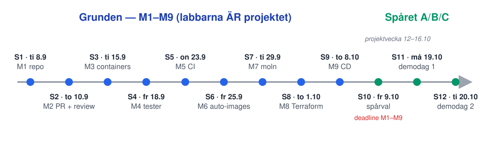
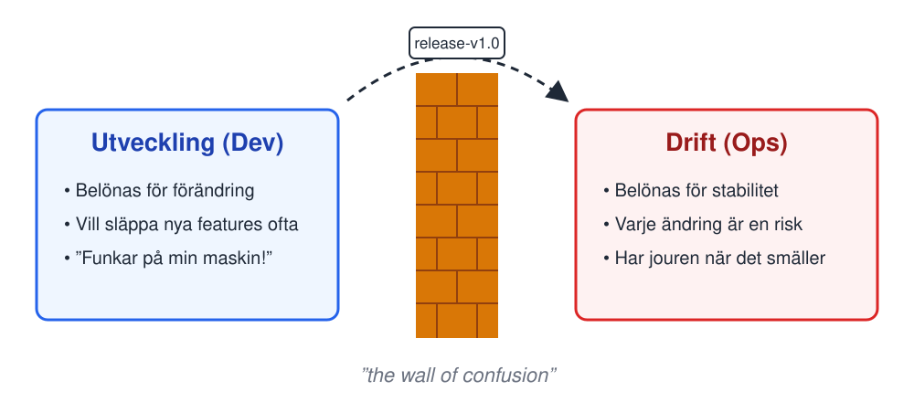
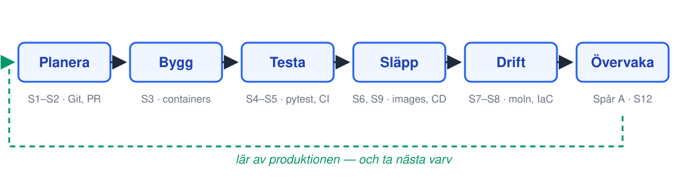

<!-- _class: lead -->
<!-- _footer: "" -->
<!-- _paginate: false -->

# Vad är DevOps?

## Session 1 · Från commit till produktion

Mjukvaruutvecklingsprocessen — DevOps
Arcada · 8.9–20.10.2026

<!--
Välkomna. Presentera dig kort (2 min max — bakgrund, varför du gillar det här
ämnet). Snabb känsla för rummet: handuppräckning — vem har använt Git? GitHub?
Docker? Vem har fått något att köra på en server som inte var deras egen dator?

Sätt tonen direkt: det här är en görakurs. Redan idag går ni hem med ett eget
repo och er första milstolpe avklarad.
-->

---

## Innan vi börjar: en fråga

Tänk på ert senaste programmeringsprojekt (kurs, hobby, jobb):

**Hur kom koden till "användarna"?**
**Hur lång tid tog det från sista ändringen tills någon annan kunde se den?**

Så här ser det oftast ut: `scp`/FTP:a filer till en server, dra en zip till
en kompis, eller köra lokalt och bara visa skärmen.

<!--
Berätta själv, inget parprat: ett konkret exempel på hur ni faktiskt
gjorde "deploy" för hand — `scp`/FTP:a filer till en server, dra en zip
till en kompis, köra lokalt och visa skärmen på ett möte. Skriv upp
exemplet på tavlan ("zippa och lämna in" fungerar bra) — det återkommer
i livscykel-slidet.

Poängen att landa i: för de flesta är avståndet mellan "koden finns" och
"koden körs för någon annan" ENORMT — dagar av manuellt pill, eller
oöverstigligt. Den här kursen handlar om att krympa det avståndet till
minuter, automatiskt.
-->

---

## Agenda idag

1. Välkommen + öppningsfråga
2. Kursen: upplägg, milstolpar, betyg
3. **Vad är DevOps?** Kultur, CALMS, DORA, livscykeln
4. Paus
5. **Lab M1** — konton, eget repo, första commit
6. Wrap-up: verifiera M1, vanliga problem, nästa gång

<!--
Ordningen för passet:
- Välkommen, presentation, öppningsfrågan.
- Kursöversikt: konceptet, kursresan, betygsmodellen,
  praktiskt. Betygsmodellen SKA kommuniceras dag 1 — hoppa inte över den.
- Föreläsning: definition, ops för hand, wall of confusion,
  CALMS, DORA + nivåband, servicelivscykeln, SDG-kopplingen.
- Paus (ca 10 min). Be dem para ihop sig INNAN pausen om de vill
  jobba i par — labben börjar med parbildning annars.
- Lab M1 enligt labs/m1-forsta-commit.md. Gå runt.
  Vanligaste stoppen: GitHub-konto saknas, författarnamn fel i commit.
- Wrap-up: kör verifiera-checklistan gemensamt och skaffa dig en
  lägesbild av hur många som har taggen uppe, teaser för session 2.

Session 1 avviker medvetet från kursens normala upplägg: mer
föreläsning eftersom kursöversikten ligger här,
kortare lab eftersom M1 är kursens minsta milstolpe.
-->

---

## Kursen i en mening

> Ni bygger **en tjänst — från första commit till automatisk produktion** —
> och varje veckas lab lägger en permanent milstolpe på samma repo.

- **Labbarna ÄR projektet.** Kursen består av labbar och en större slutuppgift — det ni gör idag ligger kvar i samma repo den 20 oktober.
- **Manuellt före automatiserat.** Ni gör allt för hand först — så att automatiseringen känns som en befrielse, inte magi.
- Appen får ni färdig (frontend + backend). Kursen handlar om **processen**, inte om att koda appen.
- Ni kommer möta mycket konfiguration — målet är aldrig att memorera den, utan att förstå vad varje fil gör och var man letar.

<!--
Det här är kursens viktigaste bild — allt annat hänger på den. Studenterna
är vana vid kurser där inlämningar är engångsgrejer. Här är repot en levande
produkt: det de committar idag är samma repo som de demo:ar i sitt bokade
demopass i oktober.

"Manuellt före automatiserat" är den pedagogiska ryggraden: de deployar för
hand i S7 innan Terraform i S8, och kör test för hand i S4 innan de tar
över CI-pipelinen som kört samma tester åt dem sedan M1 (S5 gör checken
obligatorisk). Säg det högt nu så känner de igen mönstret senare.

Appen: en liten notes-app, frontend (HTML/JS + nginx) + backend (FastAPI),
docker compose. Medvetet enkel — som deras tidigare webbkurser.
-->

---

## Kursresan: 12 sessioner, 9 milstolpar, 1 spår

Varje milstolpe avslutas med en **tagg** i repot och har ett tydligt **bevis**.
Arbete som inte syns i repot dokumenteras kort i `inlamning/`.

<!--
Peka i kartan: blått = grunden (M1–M9), grönt = spårdelen. Nyckelbudskap:

1. Den som hänger med i undervisningen har grunden KLAR efter session 9 —
   inget hänger löst till tentaveckan.
2. Missad session är inte kört: milstolparna går att göra i egen takt. Tre
   nivåer, säg dem en gång (de står också i rubriken de får idag):
   M1–M9 BÖR vara klara till session 10 (spårvalet blir ett informerat val
   först då), HÅRD deadline för allt är det bokade demopasset 19–20.10, och
   repot får putsas till ti 27.10 23:59 innan poängen läses.
3. Spåren (berättas mer i S10): A drift & observability, B GitOps &
   Kubernetes, C DevSecOps. Alla bygger ovanpå samma grundprojekt.
4. "Bevis" är alltid något körbart/klickbart: en mergad PR, en grön
   pipeline, en URL som svarar — aldrig "det funkade på min dator".

Taggen räcker att nämna här som "en markering i git-historien" — hela
förklaringen kommer på egen slide precis före labben. Första taggen sätter
de idag.

Bevisvanan: en del milstolpe-arbete syns aldrig i repot (inställningar på
GitHub, konsolklick i molnet, terraform-körningar). Template-repot har en
färdig inlamning/-mapp med exempelfil (inlamning/m0-exempel.md) — vid varje
tagg skriver de några meningar + skärmdump där. Introducera vanan nu; varje
lab påminner vid sitt tagg-steg.
-->

---

## Betyg (max 110 p): M1–M9 är grunden, final task ger höjden

| Del | Poäng |
|---|---|
| Milstolpar M1–M9 | 0–9 p per milstolpe (helhetsbedömning) = max **81** |
| Final task (valt spår A/B/C) | 0–19 p — fungerande demo, robusthet, dokumentation, demofrågor |
| **Kärnsumma** | **100** |
| Bonus: repo-hygien, commit-historik, PR-disciplin, fungerande kedja | **+10** |
| **Max** | **110** |

**Betygsgränser:** 0–50 Underkänt · 51–60 = 1 · 61–70 = 2 · 71–80 = 3 · 81–90 = 4 · 91+ = 5

<!--
Detta speglar betygsrubriken (grading/grading-rubric.md) som delas ut som
A4 idag — säg att pappret finns och var de hittar den digitala versionen.

Poängen gör betyget mekaniskt förutsägbart: varje milstolpe bedöms 0–9 som
helhet, final task väger dubbelt (0–19), och de fyra kvalitetskriterierna
är bonus (+10) — mer om båda på nästa två slides.
-->

---

## Hårda krav utöver poängen

- Godkänt kräver **minst 51 p OCH individuell reflektion** (~1 sida)
- Betyg **5** kräver final task med **fungerande live-demo** — demon hålls som **individuellt bokade 30-minuterspass** i slutet av kursen

*Utan final task med live-demo är taket alltså betyg 4 — oavsett poäng.*

<!--
Vanlig fråga: "måste jag göra final task?" — utan den kan man samla max
81+10 = 91 p på pappret, men betyg 5 kräver final task med fungerande
live-demo, så taket blir betyg 4. Demon bokas som ett individuellt
30-minuterspass i slutet av kursen.

Reflektionen (~1 sida, deadline fr 23.10, efter demodagarna): produktens livscykel +
"vad går sönder utan automation?". Utan den blir det inte godkänt, oavsett
poäng. Nämn den nu, tjata inte.
-->

---

## Bonus +10 p — vad "kvalitet" betyder

- **Repo-hygien** — rimlig `.gitignore`, inga secrets committade, tydlig struktur
- **Commit-historik** — många små commits med tydliga meddelanden, inte en jättecommit i slutet
- **PR-disciplin** — featurebranches, PR med review innan merge till main
- **Fungerande kedja** — varje milstolpe har verifierbart bevis

**Par är välkomna** (rekommenderas!) — men betyget är alltid **individuellt**: Git-historiken visar vem som gjort vad, och vid demon får **båda** frågor.

<!--
Konkretisera med dagens lab: redan M1 bedöms så här — en commit med
meddelandet "asdf" är sämre kvalitet än "Add team names to README". Kvalitet
är inte extraarbete, det är hur man jobbar hela vägen.

Par-regeln är viktig att landa exakt: samma repo är OK och uppmuntrat, men
båda ska committa under EGET GitHub-konto (Git-historiken är
betygsunderlag), och i det bokade demopasset får båda i paret frågor var
för sig och måste kunna redogöra för sin del av kedjan. "Min kompis gjorde CI-delen" räcker inte.

Detta speglar också grading/grading-rubric.md — samma formuleringar.
-->

---

## Praktiskt

- **När:** 10 lektionstillfällen 8.9–9.10 · 165 min per pass · plus demodagarna 19–20.10 (bokat 30-minuterspass, ingen gemensam lektion)
- **Var:** schema enligt Arcadas system — tider varierar (ti/to/fr/må)!
- **Par eller solo:** par rekommenderas, bildas idag i labben
- **Material:** kursens material-repo + itslearning; appen kommer från ett template-repo på GitHub
- **Verktyg:** allt är gratis — GitHub (Education), CSC:s moln (via Haka)
- **Kontocheck:** GitHub, GitHub Education (valfritt tips), CSC via Haka — vi gör det tillsammans som steg 0 i dagens lab, ingen förberedelse hemma behövs

<!--
Kontocheck görs gemensamt som steg 0 i labben (samma innehåll finns i
onboarding/student-onboarding.md — GitHub-konto, GitHub Education,
CSC via Haka). Alla börjar där, oavsett om någon råkat kika på
materialet i förväg.

Betona att tiderna varierar mellan veckodagar (se kursresan-kartan) — det
är lätt att missa fredagspassen. Uppmana dem att lägga in schemat direkt.

CSC-kontot behövs på riktigt först i session 7, men Haka-flödet kan strula —
därför ska det göras nu, inte den 29.9. Själva CSC-PROJEKTET (ett per par,
båda medlemmar) skapar de först efter parbildningen, som hemuppgift efter
labben — instruktionen står i labs/m1-forsta-commit.md, avsnittet "Efter
labben". Deadline: före session 7, för CSC:s godkännanden tar dagar. Nämn
det när ni går igenom steg 0, påminn igen i S6.
-->

---

<!-- _class: lead -->

# Del 2: Vad är DevOps?

<!--
Nu börjar själva föreläsningen — fram till pausen.
-->

---

## DevOps är inte...

- ...ett **verktyg** man köper (”vi har Jenkins, alltså har vi DevOps”)
- ...en **titel** (”vi anställde en DevOps så nu är det löst”)
- ...ett **team** som sitter mellan Dev och Ops *(varning: en ny silo!)*

## DevOps är...

> En **kultur och ett arbetssätt** där de som bygger och de som driftar delar ansvar för hela kedjan — så att kod går från commit till produktion **snabbt, säkert och upprepbart**.

<!--
Alla tre antimönster finns på riktigt i industrin, och alla tre kommer
studenterna att möta i jobbannonser ("DevOps Engineer sökes"). Var ärlig:
titeln finns och folk får lön med den — men om DevOps blir en separat
funktion som ÄGER deployen har man bara byggt en tredje silo, och forskningen
(DORA) visar att det inte ger effekten.

Definitionen på sliden är kursens arbetsdefinition. Nyckelorden: delar
ansvar (kultur), hela kedjan (livscykeln), snabbt och säkert SAMTIDIGT
(det är där forskningen överraskar — mer om det strax).
-->

---

## Ni har redan gjort ”ops” — för hand

I skolprojektet var ni både dev och ops: någon kopierade filer till servern kl 02, och bara den personen visste hur.

Det håller för tre personer och en tjänst. Lägg till folk, tjänster och riktiga användare — så spricker det på ett av två sätt:

- **Alla gör allt** — kaos, ingen vet vad som körs
- **Vi specialiserar** — Dev här, Ops där… och en mur emellan

<!--
Den här sliden är bryggan från öppningsfrågan till muren — bygg den på
DERAS exempel från tavlan, inte på mitt. Fråga rakt ut: "vem var er
ops-person?" Nästan varje team har haft en.

Poängen är INTE att de gjorde fel. Manuell deploy fungerar i liten skala.
Det som inte skalar är att kunskapen och handlaget sitter i en person.

De två utfallen är kursens karta:
- "Alla gör allt" är vad kursens automationshalva (M3-M9) svarar på: det
  som vem som helst ska kunna göra måste vara skrivet ner och kört av en
  maskin, inte hållet i någons huvud.
- "Vi specialiserar" leder rakt in i nästa slide — muren.

Så här upptäckte branschen samma sak: Agile (2001) löste HALVA problemet —
dev började leverera i små steg, men ändringarna ställde sig i kö framför
en release-process byggd för stora, sällsynta releaser. 2009 visade
Flickr-talket på Velocity ("10+ Deploys Per Day", Allspaw & Hammond) att
10 deploys om dagen inte var magi utan verktyg + kultur: automatiserad
infra, delade metrics, blame-fritt samarbete mellan dev och ops. (Samma år
myntades ordet på första devopsdays i Gent — Patrick Debois. Amazons "you
build it, you run it" är samma idé, tre år tidigare.)

VIKTIGT att inte säga: att det här är ett storföretagsproblem. Det är fel —
DevOps växte fram i små, autonoma team (Flickr, Etsy, Amazon), och
storföretagen var eftersläntrarna. Det som växer med organisationsstorlek
är SILORNA, inte behovet. Ett team på tre har sin egen mur: mellan "min
laptop" och "servern", eller runt den enda som vågar deploya. DORA-
forskningen (Accelerate) fann att effekten av de här arbetssätten håller
oberoende av bransch och företagsstorlek.

Att snabbhet och stabilitet inte är en trade-off tar vi på DORA-sliderna
strax — här räcker en bisats om någon invänder "blir det inte skört av att
deploya ofta?".
-->

---

## Muren

**Var har ni sett en sådan här mur?** (skola, jobb, hobbyprojekt...)

<!--
Det andra utfallet, i klassisk form: "wall of confusion" — två grupper med
MOTSATTA incitament. Dev belönas för förändring, Ops för stabilitet — båda
gör sitt jobb rätt, och resultatet blir ändå långsamt och skört. Felet
sitter i strukturen, inte i människorna. Det är därför "anställ bättre
folk" inte fixar det.

Diskussionsfrågan (2-3 min): låt dem hitta egna murar. Exempel som brukar
komma: gruppmedlemmen som "äger" inlämningen och är enda som vågar röra
den; IT-avdelningen man måste ticketa för att få något installerat;
"testaren" som får allt i famnen sista dagen. Alla är samma mönster:
överlämning + delat ansvar = ingens ansvar.

Övergång: DevOps svar är att riva muren — men hur gör man det konkret?
CALMS är ett sätt att sortera svaret.
-->

---

## CALMS — fem linser på DevOps

| | | I den här kursen |
|---|---|---|
| **C** | Culture — delat ansvar, blame-fri felsökning | par + review, avslutande reflektion |
| **A** | Automation — bygg, test, deploy utan handpåläggning | CI/CD (S5–S6, S9), IaC (S8) |
| **L** | Lean — små steg, snabb feedback, kort kö | små PR:ar, täta releaser |
| **M** | Measurement — mät det som spelar roll | DORA går att räkna ut på ert repo |
| **S** | Sharing — kunskap och verktyg delas | demos, gemensam template |

<!--
Ursprung: CAMS (Damon Edwards & John Willis, 2010), L tillkom senare via
Jez Humble. Använd CALMS som DIAGNOS-lins, inte som checklista: när något
känns trögt eller går sönder — vilken bokstav saknas?

Gå igenom kolumnen "i den här kursen" snabbt — poängen är att kursen inte
bara pratar CALMS utan är byggd efter den: allt de gör mappar mot någon
bokstav.

Snabb diskussionsfråga (1-2 min, handuppräckning eller grannprat): "Vilken
bokstav blir svårast för ett tvåpersonersteam i den här kursen?" Vanligt
och bra svar: C känns trivial i par ("vi är ju kompisar") — tills första
gången den enas push sabbar den andras demo. S glöms ofta: dokumentera så
att par-kompisen kan ta över.
-->

---

## CALMS — det finstilta

Ärlig varudeklaration:

- **Kultur går inte att köpa.** Verktygen är den lätta delen — beteenden (vem vågar säga ”jag gjorde sönder det”?) är den svåra.
- **Automatiserar du en trasig process får du en snabb trasig process.**
- **L är den bortglömda bokstaven** — stora releaser *känns* säkrare men är farligare.
- **Mätvärden som blir mål slutar mäta** (Goodharts lag) — gör deployment frequency till mål och folk deployar tomma commits.

<!--
Den här sliden finns för att studenterna INTE ska lämna kursen med bilden
att CALMS är en färdig lösning man "inför". Punkterna:

1. Kultur: blame-fri betyder inte kravlös — det betyder att felsökning
   riktas mot systemet ("hur kunde pipelinen släppa igenom det här?") i
   stället för personen. Fråga retoriskt: vågar NI säga "det var jag" i ert
   par? Det är kulturmåttet som räknas.
2. Automation: om testerna är dåliga gör CI bara dåligheten snabbare och
   oftare. Därför kommer S4 (testning) FÖRE S5 (CI) i kursen.
3. Lean: intuitionen "samla ihop och släpp sällan" är fel — stor batch =
   fler ändringar per release = svårare felsökning när det smäller.
   Referens: Accelerate-fyndet som kommer på DORA-sliderna.
4. Goodhart: om deployment frequency blir ett MÅL kan man deploya tomma
   commits. Mät för att LÄRA, inte för att tävla. Relevant för nästa slide —
   DORA-metrics är tänkta som spegel, inte som piska.
-->

---

## DORA: fyra nyckeltal

Forskningsprogrammet DORA (*Accelerate*, Forsgren m.fl.) — fyra mått som tillsammans fångar både **fart** och **stabilitet**:

| Fart | Stabilitet |
|---|---|
| **Deployment frequency** — hur ofta når kod produktion? | **Change failure rate** — hur stor andel av ändringarna orsakar fel i produktion? |
| **Lead time for changes** — commit → produktion, hur länge? | **Failed deployment recovery time** — hur snabbt är ni tillbaka efter ett haveri? |

I slutet av kursen **kan ni** räkna ut dessa fyra på ert eget repo.

<!--
Definitionerna är ordagrant viktiga:
- Deployment frequency: hur ofta PRODUKTION uppdateras — inte hur ofta man
  committar.
- Lead time: från commit till körande produktion. Fångar hela kedjans
  friktion: väntan på review, manuella steg, releasefönster.
- Change failure rate: andel deployer som kräver åtgärd (hotfix, rollback).
- Recovery time: hette tidigare "time to restore service" / MTTR — DORA
  bytte 2024 till "failed deployment recovery time" för att avgränsa till
  fel orsakade av deployer.

Poängen med 2x2-uppdelningen: två mäter fart, två mäter stabilitet — och
forskningens huvudfynd är att BRA team är bra på BÅDA samtidigt. Man väljer
inte.

Sista raden är en genuin möjlighet, inte ett schemalagt kursmoment: i
slutet av kursen har de en Git-historik + Actions-historik +
produktionsmiljö, och kan räkna ut sina egna fyra tal om de vill. Få
kurser ger den möjligheten.
-->

---

## Var ligger ribban? (DORA 2024)

| Nivå | Deploy­frekvens | Lead time | Change failure rate | Recovery |
|---|---|---|---|---|
| **Elite** (19 %) | on demand | < 1 dag | 5 % | < 1 h |
| **High** (22 %) | dag–vecka | 1 dag–1 vecka | 20 % | < 1 dag |
| **Medium** (35 %) | vecka–månad | 1 vecka–1 månad | 10 % | 1 dag–1 vecka |
| **Low** (25 %) | månad–halvår | 1–6 månader | 40 % | 1 vecka–1 månad |

Källa: DORA *State of DevOps Report* **2024** — sista rapporten med nivåband.

**Gissa:** var hamnar ett typiskt studentprojekt? Var är **ni** den 20 oktober?

<!--
Läs tabellen radvis och låt den sjunka in: elite-team deployar närhelst de
vill, är i produktion inom en dag och tillbaka inom en timme när något går
fel. Low-team släpper någon gång i halvåret och 40 % av släppen går sönder.

Två ärliga fotnoter — säg dem högt:
1. Kuriosa i 2024-data: medium har LÄGRE change failure rate (10 %) än high
   (20 %) — första gången banden inte rör sig i takt. Möjlig tolkning:
   försiktiga team köper stabilitet med fart. Bra diskussionsämne, olöst
   fråga även för DORA.
2. Färskhetsvarning: 2025 års rapport (State of AI-assisted Software
   Development) PENSIONERADE nivåbanden och ersatte dem med sju
   "team archetypes". Det femte måttet, rework rate, kom redan i
   2024-rapporten. 2024 är alltså sista årgången med den klassiska
   elite/high/medium/low-tabellen — därför står årtalet på sliden.
   Uppdatera sliden när DORA publicerar nya band.

Frågan är retorisk — ställ den, svara sedan själv: typiskt studentprojekt =
low eller under (deploy = inlämning, en gång per kurs...). Kursens mål
konkret: med M9 klar är deras deployfrekvens "varje merge till main" och
lead time minuter — elite-nivå på fartmåtten. Stabilitetsmåtten kräver
produktion över tid — var ärlig med det.
-->

---

## Servicelivscykeln

En tjänst är inte **klar** när koden är skriven — den ska släppas, driftas, övervakas och förbättras. Kursen är **ett varv genom hela cykeln**, på er egen tjänst.

<!--
Knyt ihop: det här är samma bild som kursresan, fast ur tjänstens
perspektiv i stället för kalenderns. Peka på mappningen under boxarna —
varje fas i cykeln har en session där den blir hands-on.

Viktig poäng för målgruppen (informationsanalys, mest webbutveckling i
bagaget): deras utbildning hittills har nästan helt handlat om "Bygg" och
lite "Testa". Den här kursen handlar om ALLT det andra — det som gör kod
till en produkt.

Gröna pilen tillbaka är DevOps-delen: utan återkoppling från drift till
planering är det bara en vattenfallspipeline. Övervaka-fasen fördjupas i
spår A; alla möter den i den avslutande reflektionen, där de tittar
tillbaka på vad kedjan lärde dem.

Öppningsfrågans återknytning: gå tillbaka till tavlan — "zippa och lämna
in" är en cykel som stannar efter Testa. Nu har de ord för vad som saknades.
-->

---

## Hållbarhet, på riktigt (SDG 9)

- **FN:s SDG 9 — Hållbar industri, innovation och infrastruktur:** bygga motståndskraftig infrastruktur och uppgradera den till att bli hållbar och resurseffektiv.
- **DevOps roll:** automatisering och IaC gör infrastruktur **pålitlig och reproducerbar**, CI/CD minskar spill — färre trasiga releaser, mindre manuellt omarbete — och `terraform destroy` är en dygd: riv det du inte använder. Molnresurser är riktiga pengar och riktig energi.

<!--
Hållbarhetsmålen ska nämnas (läranderesultat) men förtjänar ärlighet, inte
greenwashing. En konkret koppling räcker:

SDG 9 handlar om infrastruktur — och det är bokstavligt vad kursen övar.
Vanan att riva miljöer man inte använder är både ekonomi och energi. I S8
blir det konkret: vi river och återuppbygger i samma lab — samma miljö
kommer tillbaka, och vanan är att riva det man inte använder mellan
passen. Idle-VM:ar är kursens miniatyr av branschens zombie-serverproblem.

Stanna där. Studenter genomskådar uppblåsta hållbarhetsslides direkt, och
trovärdigheten spiller över på resten av kursen.
-->

---

<!-- _class: lead -->

# Lab: M1

## Konton · eget repo · första commit

<!--
Paus FÖRE det här. Efter pausen: parbildning först (2 min),
sedan labben. Instruktionen finns i labs/m1-forsta-commit.md — visa var den
ligger (material-repo/itslearning).
-->

---

## Vad är en tagg — och varför taggar vi?

En **tagg** är ett namn på en bestämd commit. Till skillnad från en branch **flyttar den sig aldrig** — den pekar på exakt samma kod för alltid.

**I riktig DevOps** märker taggar releaser (`v1.2.3`): release-pipelinen triggas av taggen, taggen svarar på frågan "vilken kod ligger just nu i produktion?", och den är punkten man rullar tillbaka till när något går sönder.

**I kursen** är det samma mekanism med ett annat syfte: `m1-repo`, `m2-review` … visar vilka commits som hör till vilken milstolpe. Git-historiken är ert betygsunderlag — taggen är kvittot som gör det mekaniskt kontrollerbart.

**Glöm inte:** `git push` skickar inte taggar — kör `git push origin m1-repo` separat. Tagga sist (taggen fastnar på HEAD just då): committa → pusha → kontrollera på GitHub → tagga → pusha taggen.

<!--
Poängen med sliden: `git tag m1-repo` i labben ska kännas motiverat, inte
som en ritual.

Bilden som brukar fastna: branchen är ett bokmärke du flyttar med dig medan
du jobbar, taggen är en spik i väggen på ett datum du vill kunna hitta
igen.

Håll det kort (1–2 min) — release-tänket kommer tillbaka på riktigt i
CI/CD-passen, där de ser en pipeline som triggas av en tagg.

Nästa slide: steg 5 i labben är just den spiken.
-->

---

## M1 — dagens milstolpe

**Mål:** ett eget repo, skapat från kursens template, med er första commit — pushad och taggad.

1. **Steg 0** — kontokoll: GitHub, GitHub Education (valfritt), CSC via Haka
2. Skapa ert repo från **template-repot** (”Use this template”)
3. Öppna miljön: **Codespace** (rekommenderas) eller klona lokalt
4. Gör en riktig ändring (t.ex. README.md), committa, pusha
5. Kontrollera committen på GitHub — tagga då: `git tag m1-repo` och pusha taggen
6. Bjud in läraren som collaborator (`Tobias-Eriksson`) och lämna in länken på itslearning

**Bevis:** repot + commit (användarnamn) + taggen + collaboratorn + länken.

<!--
Bevis-kravet i korthet: allt är nu synligt/verifierbart, inget osynligt
kvar för M1. Collaborator-inbjudan till läraren är obligatorisk för ALLA
(inte bara privata repon) — det är betygsunderlag. GitHub-länken lämnas in
på itslearning under "Milstolpe 1".

Codespace-tipset i punkt 3: GitHub raderar en codespace efter 30 dagars
inaktivitet (default-retention), och timern nollställs varje gång man öppnar
den. Inget repo-innehåll försvinner — allt pushat ligger kvar på GitHub —
men miljön och ev. ocommittade ändringar är borta, och devcontainern måste
byggas om från grunden vid en ny codespace. Kursen har pauser kring
projektveckorna, så påminn om att hoppa in minst en gång i månaden för att
slippa ombygget.

Om någon frågar om `.devcontainer/devcontainer-lock.json` i `git status`:
det är en lockfil för devcontainer-features (som `package-lock.json`) —
devcontainer-bygget kan lösa till nyare versioner än lockfilen anger, så
den visas som ändrad innan de rört något. Helt okej, får vara med i
commit 1. Ska INTE gitignoreras — den ger reproducerbara miljöer.
Detaljerad förklaring finns i labbens "Vanliga problem".

Punkt 4:s ändring: vilken ändring som helst går bra — README.md eller
något i frontend/ + backend/, men inte workflows/ eller infra-filer.

Punkt 5: taggen fastnar på den commit som är HEAD när `git tag` körs —
därför kontrollera på GitHub FÖRE man taggar, aldrig efter. Taggade någon
fel commit av misstag? Labbens felsökning ("Taggen pekar på fel commit")
har ta-bort-och-tagga-om-receptet — ta inte upp det på sliden.

Följ labs/m1-forsta-commit.md — den har exakta kommandon, en
verifiera-checklista och en "vanliga problem"-sektion. Låt studenterna
själva läsa; svara inte på frågor som labben redan besvarar, utan peka dit
(träna vanan att läsa instruktionen — den behövs i M7–M9).

Par: ETT repo per par, båda som collaborators, och BÅDA gör minst en commit
under eget konto redan idag — betygsunderlag från dag 1.

Vanligaste stoppen att vänta sig som handledare:
- GitHub-konto/Education saknas → steg 0 i labben.
- Commit-författare = fel namn/e-post → labbens problemsektion (git config).
- Taggen syns inte på GitHub → de glömde pusha taggen separat.
- CSC/Haka strular → INTE blockerande för M1, behövs först S7. Anteckna
  vilka som fastnade och följ upp.
-->

---

## Wrap-up: är M1 klar?

Kör checklistan tillsammans:

- [ ] Repot finns på GitHub — skapat **från template** (inte fork, inte tomt)
- [ ] `git log` visar er commit — med **rätt författarnamn**
- [ ] Committen syns på GitHub (pushen gick fram)
- [ ] Taggen `m1-repo` syns under **Tags** på GitHub
- [ ] I par: **båda** är collaborators, båda har committat
- [ ] Läraren är inbjuden som collaborator, och GitHub-länken är inlämnad på itslearning (**"Milstolpe 1"**)

Fastnade du? Ta problemet **olöst** till session 2 — vi löser det där.

<!--
Kör som gemensam avstämning: gå igenom checklistan punkt för punkt
tillsammans. Det normaliserar att inte vara klar OCH ger dig en
lägesbild av hur många som har taggen uppe — det är den baseline
session 2 öppnar med (S2 jämför mot den, ingen ny räkning).

"Ta problemet olöst till session 2" är en medveten formulering (samma som i
onboardingen): ingen ska sitta hemma och kämpa ensam med ett kontoproblem.
Men milstolpen ska i mål — påminn om att ALLA milstolpar bör vara klara
till session 10 (hård deadline: demopasset), och att M2 bygger direkt på
M1:s repo.
-->

---

## Nästa gång

**Session 2 · to 10.9 kl 09:15 — Versionshantering**

Branches, merge-konflikter, pull requests, code review.
**M2:** arbetsflöde med branch protection — par granskar varandras PR:ar, solo granskar sin egen i PR:en.

**Ta med:** ett fungerande M1-repo (det ni byggde idag).

<!--
OBS torsdag 09:15 — annan veckodag och MORGONTID, säg det tydligt.

Nästa session slår vi på branch protection i deras repon — därefter är
"pusha rakt till main" tekniskt omöjligt, och det är poängen.

Sista ordet innan de går: den som INTE fick upp taggen idag — gör klart
före torsdag om det går, be om hjälp via itslearning eller mejla läraren annars. M2 bygger
direkt på M1.
-->
