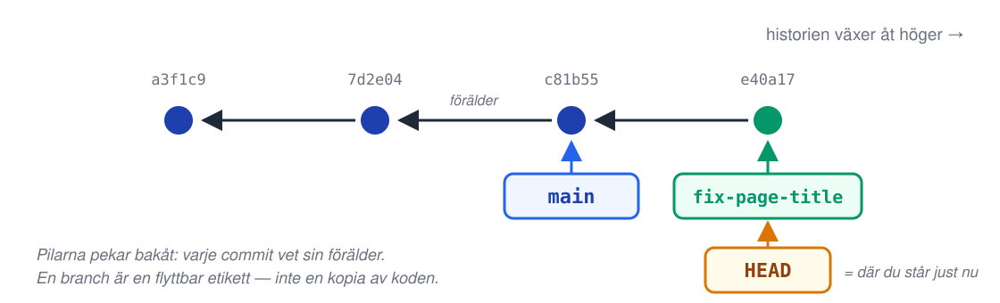
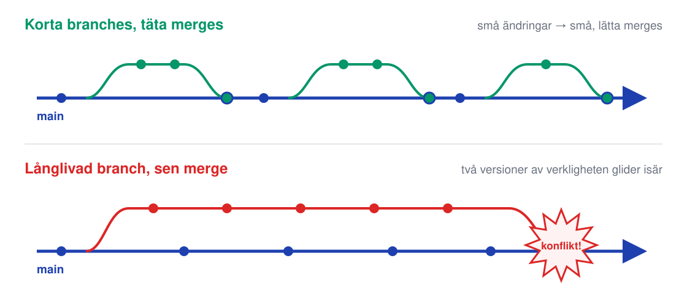
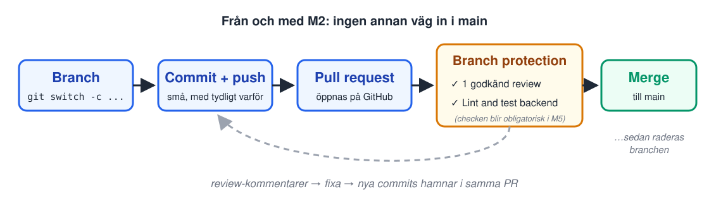

<!-- _class: lead -->
<!-- _footer: "" -->
<!-- _paginate: false -->

# Versionshantering

## Session 2 · Branches, merge-konflikter, pull requests, code review

Mjukvaruutvecklingsprocessen — DevOps
Arcada · 8.9–20.10.2026

<!--
OBS morgonpass — 09:15, annan veckodag än session 1. Räkna med att några
droppar in sent; börja ändå i tid.

Öppna med M1-avstämningen direkt (nästa slide) — du har en baseline från
session 1:s wrap-up (andelen som hade taggen uppe). Dagens session är den
där kursens arbetssätt sätts: efter idag går ingen ändring in i main utan
granskad PR. Det löftet gavs i slutet av session 1 — idag infrias det.
-->

---

## Läget: resultat från M1?

- Repot finns, skapat från template
- Commit med taggen `m1-repo` är uppe på GitHub

**Fastnade du?** Läraren hjälper under labben.


<!--
Avstämningen: snabb, inte utpekande — gå igenom listan gemensamt, jämför
med baseline från S1. De som fastnade gör klart M1 som steg 0 i dagens lab
(M2 bygger direkt på M1-repot, så det MÅSTE vara klart idag).

Tankenöten är retorisk — ställ den, svara sedan själv: "vi turades om",
"vi skickade filer på Discord", "vi jobbade i olika filer", "vi hade en
Google Doc-mentalitet — sist som sparar vinner". Skriv upp ett par
strategier på tavlan.

Poängen att landa i: alla de strategierna är sätt att UNDVIKA samtidigt
arbete. Git är byggt för motsatsen — att två personer ändrar samma kodbas
samtidigt och sedan förenar resultatet kontrollerat. Det är dagens tema,
inklusive vad som händer när föreningen krockar.
-->

---

## Agenda idag

1. Läget efter M1
2. **Föreläsning:** branches, merge, konflikter, PR, code review
3. Paus
4. **Lab M2** — branch protection, buddy-review, en riktig konflikt
5. Wrap-up: verifiera M2, vanliga problem, nästa gång

<!--
Ordningen för passet, enligt kursens normala upplägg (kort föreläsning,
tyngdpunkten på labben, wrap-up i lugn takt):
- M1-avstämning + tankenöten.
- Föreläsning: varför branches, vad en branch är,
  merge, konfliktens anatomi + lösning, små täta merges (trunk-based),
  PR-flödet, review-kultur (bra/dåliga kommentarer, checklistan,
  sociala kontraktet).
- Paus (ca 10 min). Påminn paren att sitta ihop efter pausen.
- Lab M2 enligt labs/m2-review.md. Gå runt. Största
  stoppen brukar vara att glömma sätta rulesetens Enforcement status till
  Active (regeln finns, gör ingenting) och att någon försöker pusha till
  main och inte förstår felmeddelandet.
- Wrap-up: verifiera-checklistan gemensamt,
  avstämning av m2-review-taggen, vanliga problem, teaser för S3.

Konfliktövningen ligger MITT i labben (efter första mergade PR:en) — se
labbinstruktionen. Den är designad att garanterat ge konflikt för alla par.
-->

---

<!-- _class: lead -->

# Del 1: Branches och merge

<!--
Föreläsningsdelen, fram till pausen. Allt praktiskt här återkommer
hands-on i labben — säg det, så ingen känner panik över att anteckna
kommandon.
-->

---

## Varför branches?

Ert repo är snart en **produkt i drift**: i M9 deployar varje merge till `main` automatiskt till produktion.

- `main` måste därför **alltid fungera** — den är inte er lekplats
- En **branch** är ett säkert arbetsutrymme: experimentera fritt, `main` påverkas inte förrän ni väljer att merga
- Namnge efter **vad** den gör: `add-get-item`, `add-color-theme` — eller med typ-prefix: `fix/broken-title`, `feature/delete-button` — inte `test`, `ny`, `asdf2`

```bash
git switch -c add-get-item     # skapa och hoppa till ny branch
git switch main                # hoppa tillbaka
git branch                     # lista brancher, * = där du står
```

<!--
Rama in med kursens slutmål, inte med Git-teori: i M9 är "merge till main" =
"deploy till produktion". DÅ är det uppenbart varför main måste skyddas.
Vi bygger vanan NU, medan insatsen är låg — så att den sitter när den blir
på riktigt.

Kommandonot: git switch är det moderna kommandot (Git 2.23+, 2019). De
kommer att se git checkout -b i äldre guider och StackOverflow-svar — det
gör exakt samma sak, checkout var bara överlastat (bytte både branch och
återställde filer, farlig dubbelroll). Säg det EN gång så blir de inte
förvirrade av internet.

Branchnamn: en bra tumregel är att namnet ska besvara "vad händer om jag
mergar den här?". I labben heter brancherna add-get-item och
add-color-theme — namnen säger exakt vad uppdraget lägger till. Båda
stilarna funkar — platt eller med typ-prefix (fix/,
feature/) som bara säger vilken sorts ändring det är. Kursen kräver ingen av
dem, men var konsekvent inom samma repo.
-->

---

## Vad är en branch egentligen?

En branch är bara en **flyttbar pekare till en commit** — inte en kopia av koden.

- Att skapa en branch är **gratis** (en 41-bytes fil i `.git/`) — skapa många, radera ofta
- Varje commit pekar på sin **förälder** → historien är en graf
- `HEAD` = pekaren till **där du står just nu**



<!--
Det här är slidens enda poäng: avmystifiera. Många studenter tror att en
branch är en mapp-kopia (som "projekt_final_v2_RIKTIG") och blir därför
snåla med att skapa dem. När polletten trillar ner — "det är bara en
pekare" — försvinner rädslan.

Rita gärna på tavlan: tre commits som noder med pilar bakåt, main som
lapp på sista, en featurebranch som lapp på en ny commit. Flytta lapparna
när du "committar". Två minuter väl investerade.

Demo-tips om tid finns (1 min): kör git log --oneline --graph --all i
terminalen så ser de samma graf på riktigt i sitt eget repo. Kommandot är
kursens röntgenbild — det återkommer i labben (och är ett utmärkt
felsökningsverktyg när någon "tappat bort" en commit). Uppmana dem att
köra det ofta under labben, särskilt före och efter merge.
-->

---

## Merge: förena två historier

```bash
git switch main
git merge add-get-item
```

Två fall:

1. **Fast-forward** — `main` har inte rört sig sedan branchen skapades → Git flyttar bara pekaren. Ingen ny commit.
2. **Merge-commit** — båda har nya commits → Git skapar en commit med **två föräldrar** som förenar dem.

GitHubs *Merge pull request*-knapp gör fall 2 (den skapar alltid en merge-commit).

<!--
Håll det här kort — mekaniken landar i labben. Det viktiga att förstå:

Fast-forward: inget att förena, main var bara "bakom". Git flyttar lappen.

Merge-commit: Git tittar på TRE punkter — den gemensamma förfadern (basen),
din branch-spets och main-spetsen — och kombinerar ändringarna från båda
sidor sedan basen. Oftast går det automatiskt: ändringar i olika filer
eller olika delar av samma fil förenas tyst.

Övergången till nästa slide: "oftast automatiskt" — men vad händer när
båda sidor har ändrat SAMMA rader? Då vägrar Git gissa. Det är ingen
krasch, det är en fråga.

(GitHub-detaljen: Merge-knappens standardläge är create a merge commit,
därav --no-ff-beteendet. Squash/rebase-alternativen finns men lämnas
utanför kursen — nämn bara om någon frågar.)
-->

---

## Merge-konflikt: så här ser den ut

```text
<<<<<<< HEAD
    <h1>Bobs anteckningar</h1>
=======
    <h1>Alices anteckningar</h1>
>>>>>>> origin/main
```

- **Ingen krasch, ingen förlorad kod** — Git ställer en fråga den inte kan besvara: *båda sidor ändrade samma rad — vilken gäller?*
- `<<<<<<< HEAD` → **din sida** (branchen du står på)
- Under `=======` → **deras sida** (det du mergar in, här: `origin/main`)
- Resten av filen är redan förenad — bara de markerade raderna är frågan

<!--
Den viktigaste sliden i föreläsningen — avdramatisera. Många har mött
markörerna en gång, fått panik, och kopierat om hela projektet till en ny
mapp. Idag begraver vi den reflexen.

Läs exemplet högt: Bob står på sin branch (HEAD = hans sida) och mergar in
main, där Alices ändring redan ligger (origin/main = deras sida). Båda
ändrade samma h1-rad. Git har förenat ALLT annat i filen — bara den här
raden kräver ett människobeslut.

Betona: markörerna är vanlig text i filen. Git har inte "gått sönder" —
den har skrivit sin fråga rakt in i filen och väntar. Filen går inte ens
att missförstå: allt mellan <<<<<<< och ======= är ena svaret, allt mellan
======= och >>>>>>> är andra.

Det här EXAKTA scenariot — samma rubrik, två par-kompisar — är
konfliktövningen i dagens lab. Alla kommer att se det här på riktigt
senare idag, avsiktligt framkallat.
-->

---

## Konfliktlösning i fyra steg

1. **Öppna filen** — sök efter `<<<<<<<`
2. **Bestäm**: din version, deras, eller en **kombination** (vanligast!)
3. **Radera markörerna** — filen ska se ut som du vill att resultatet ska se ut
4. Tala om för Git att du är klar:

```bash
git add frontend/index.html
git commit                # färdigt förslag på meddelande finns redan
```

**Panik?** `git merge --abort` ångrar hela mergen — tillbaka till läget före. Andas, försök igen.

<!--
Gå igenom stegen lugnt. Steg 2 är det enda som kräver tanke — och ofta är
rätt svar en kombination (i labbens övning: en rubrik med bådas namn).
Steg 3 glöms oftast: kvarlämnade markörer är vanlig text och följer med i
committen — appen visar då bokstavligen "<<<<<<< HEAD" för användaren.
(CI:n kommer inte att rädda er här — markörer i HTML är giltig text.)

git commit utan -m öppnar editorn med Gits färdiga förslag ("Merge branch
..."). Det räcker gott — spara och stäng. Vim-fällan: den som hamnar i vim
skriver :wq. Säg det innan det händer, det sparar tre handuppräckningar.

git merge --abort är psykologiskt viktigt: det finns ALLTID en nödutgång,
inget är förstört. Rädslan för att "ha sönder repot" är största hindret
för att våga merga ofta.

Demo-möjlighet om tiden tillåter (5 min): framkalla konflikten live i
terminalen med två brancher enligt labbens recept och lös den. Annars:
labben gör det ändå — varje par, på riktigt.
-->

---

## Därför: små branches, täta merges



Konfliktens storlek växer med **tiden två historier glider isär** — inte med er skicklighet.

<!--
Kursens kanske viktigaste arbetssättspoäng — ta tid på den här sliden.

Övre bilden: branchen lever timmar–dagar, mergas, dör. Varje merge är
liten; en konflikt (om den alls uppstår) handlar om några rader man ändrade
i morse — trivial att lösa.

Nedre bilden: branchen lever i veckor medan main rör sig. Vid den sena
mergen krockar ackumulerade ändringar — konflikten handlar om kod ingen
minns längre, och att "lösa" den blir gissningsarbete. Klassikern i
studentprojekt: alla mergar kvällen före deadline, och natten försvinner.

Landa slutsatsen: konflikter undviks inte genom att vara försiktig eller
duktig — de undviks genom att inte låta historierna glida isär. Merga
ofta = håll konflikterna små. Det här är trunk-based development, och det
är forskningsstött: DORA/Accelerate (S1) visar att high performers jobbar
med korta branches och täta merges till trunk — det är en av de metoder
som statistiskt driver både fart OCH stabilitet.

Resten av kursen kör så: varje milstolpe = en eller flera små PR:ar som
mergas samma dag. Aldrig en jättebranch.
-->

---

<!-- _class: lead -->

# Del 2: Pull requests och code review

<!--
Halvvägs i föreläsningen — från Git-mekanik till arbetssätt och kultur.
-->

---

## Pull request: ett förslag + ett samtal

En PR är **inte** en Git-funktion — den är GitHubs lager ovanpå: *"jag föreslår att den här branchen mergas till main — vad säger ni?"*

- **Diffen** — exakt vad som ändras, rad för rad
- **Samtalet** — kommentarer, frågor, förslag — *innan* koden landar
- **Checkarna** — CI kör automatiskt på varje PR *(kolla Actions-fliken: `Lint and test backend` har kört på ert repo sedan M1)*
- Pushar du fler commits till branchen hamnar de **i samma PR** — så åtgärdar man review-kommentarer

<!--
Begreppsreda: git request-pull finns men ingen använder den — i praktiken
är "pull request" GitHubs uppfinning (GitLab säger merge request, samma
sak). Namnet är historiskt: "jag ber dig pulla min branch".

Aha-momentet att leverera: CI:n har redan kört på deras repon. Workflowen
(.github/workflows/ci.yml) följde med från template-repot i M1 — varje PR
de öppnar idag får automatiskt en grön eller röd check som heter "Lint and
test backend". De har en pipeline utan att ha byggt den. I S5 öppnar vi
motorhuven och skriver egna; idag räcker det att SE den jobba.

Sista punkten är praktiskt viktig för labben: studenter tror ofta att man
måste stänga PR:en och öppna en ny när reviewern hittar något. Nej — fixa,
committa, pusha; PR:en uppdateras och reviewern tittar igen.
-->

---

## Flödet ni kör från och med idag



<!--
Gå igenom bilden vänster till höger — det här är M2:s hela innehåll och
kursens arbetssätt för resten av perioden:

branch → små commits → PR → grinden → merge → branchen raderas.

Grinden (branch protection) är dagens nya sak: en ruleset PÅ GitHub-repot
som gör att merge-knappen är låst tills kraven är uppfyllda. I M2 slår ni
på review-kravet — **1 godkänd review för par, 0 för solo** (ingen kan
approva sin egen PR, så solo granskar sin egen i PR:en) — och glöm inte
att sätta rulesetens
Enforcement status till Active, annars gör den ingenting. Statuschecken
"Lint and test backend" SYNS
redan på varje PR — men obligatorisk (= röd pipeline blockerar merge) gör
vi den först i M5, när ni har byggt pipelinen själva och förstår vad den
gör. En grind i taget.

Den streckade pilen tillbaka: review är en LOOP, inte en dom. Kommentar →
fixa → pusha → samma PR uppdateras → godkänn → merge.

"Branchen raderas": efter merge är branchen skräp — historiken finns i
main. GitHub erbjuder Delete branch-knappen direkt efter merge; använd
den. Repo-hygien (och det bedöms — rubrikens "repo-hygien" inkluderar
inte tjugo döda brancher).

Rubriken på bilden är löftet från session 1: ingen annan väg in i main.
Det gäller även mig som lärare i kursens repon — säg det igen, det är
kulturbygget.
-->

---

## Review: samma kommentar, två sätt

| ✗ Så här inte | ✓ Så här |
|---|---|
| ”Det här är fel.” | ”`fetch` saknar felhantering — om backend är nere visas en tom sida. Kan vi visa ett felmeddelande?” |
| ”Varför gjorde du så??” | ”Jag hade väntat mig `switch` här — vad fick dig att välja `if/else`? Kanske missar jag något.” |
| ”Snyggt!! LGTM 🚀” *(utan att ha läst)* | ”Kollat: körde appen på 8080, temat syns och knappen är läsbar. En fundering på rad 12, annars klart.” |

**Mönstret:** peka på **rad**, säg **varför**, föreslå **väg framåt** — och ställ frågor i stället för att döma.

<!--
Gå igenom raderna en i taget — kontrasten gör jobbet:

Rad 1: "Det här är fel" ger mottagaren ingenting: VAR, VARFÖR, VAD i
stället? Den bra versionen pekar på rad, beskriver konsekvensen (tom sida)
och föreslår riktning — den går att agera på direkt.

Rad 2: "varför gjorde du så??" är en anklagelse med frågetecken. Den bra
versionen är en äkta fråga som öppnar för att REVIEWERN kan ha fel — och
det händer ofta! En bra review är ett samtal mellan likar, inte en rättning.

Rad 3 är subtilast och viktigast för M2: rubber stamp. En LGTM utan att ha
läst KÄNNS snäll — men den säger "din kod är inte värd min tid" och gör
hela grinden till teater. Den bra versionen visar receptet: säg vad du
faktiskt KONTROLLERADE. Då betyder godkännandet något.

I par-övningen idag är risken just rad 3 — man är ju kompisar. Säg det
rakt ut: den snällaste review din buddy kan få är en som hittar något
innan det landar i main.
-->

---

## No hello: hela frågan direkt

| ✗ Så här inte | ✓ Så här |
|---|---|
| ”Hej, har du tid?” *(väntar på svar)* | ”Hej — git-fråga: kör jag `X` får jag `Y`, vad missar jag?” |
| PR-kommentar: ”Kolla min PR?” | PR-beskrivning: vad, varför, var — allt granskaren behöver för att agera |

Skicka inte en hälsning och vänta — lägg hela frågan, med kontext, i **första** meddelandet. Gäller PR-beskrivningar och Slack/Teams-chattar lika mycket som review-kommentarer. (Se [nohello.net](https://nohello.net).)

<!--
Samma färdighet som review-kommentarerna på förra sliden: ge mottagaren
allt den behöver för att agera direkt, i första meddelandet — oavsett om
det är en PR-beskrivning, en review-kommentar eller en chattfråga. Annars
kostar varje fråga en hel pingpong-runda av väntan.
-->

---

## Reviewn ska läsas — särskilt när AI skrev koden

Claude Code, Codex och Gemini ligger i devcontainern. Codex har en gratisnivå (per 9.9.2026) — den som har en egen prenumeration på Codex, Gemini eller Claude kan använda den i stället.

- **Som reviewer:** läs diffen tills du förstår den — en LGTM på kod ingen läst är dubbelt tom när diffen kom ur en prompt
- **Som författare:** läs din egen diff *innan* du öppnar PR:en. Kan du inte förklara varje rad är den inte klar för review
- Läs **kommentarerna du får tillbaka** — svar på riktiga frågor, inte formaliteter
- **I labben:** uppdrag A/B får göras med AI — men PR:en står alltid i **ditt** namn

**AI genererar — vi granskar som människor.** Ansvaret för `main` är ert.

<!--
Ingen pekpinne här — verktygen ligger i devcontainern med flit (Claude
Code, Codex, Gemini), och de kommer att användas. De skriver gärna,
snabbt och självsäkert — men de förstår inte appen. Poängen är var ansvaret
hamnar: en modell kan skriva hundra rader på tio sekunder, och den enda
punkten i flödet där en människa faktiskt läser dem är reviewn. Hoppar
båda över det steget har ingen i teamet förstått koden i main — och den
som får felsöka den kl 23 är inte modellen.

Säg det åt båda hållen, för författarrollen är den som glöms: att läsa sin
EGEN AI-genererade diff innan man öppnar PR:en är samma arbete som
reviewern gör, bara tidigare. Tumregeln att ge dem: kan du inte förklara
en rad för din buddy, är den inte klar för review.

Koppla framåt till checklistan på nästa slide — punkt 1 "Förstår jag
ändringen?" är exakt det här, och den gäller lika mycket för den som
skrev PR:en.

Labbens AI-väg (steg 3) har färdiga prompter för uppdrag A och B — säg att
den är tillåten och likvärdig, inte en genväg: ny branch, bara uppgiftens
filer, och STUDENTEN kör själv testerna innan hen kommenterar (verktygets
PR-text är ett påstående). Codex CLI verifierad på ChatGPT Free
2026-09-09 — kolla att gratisnivån finns kvar innan kursstart, annars
gäller egen prenumeration eller att göra ändringen för hand.

Tekniska detaljen bakom raden "PR:en står i ditt namn": gh öppnar PR:en
med studentens egen GitHub-inloggning, så PR-ägaren är ALLTID studenten —
ett AI-verktyg kan aldrig vara den andra granskaren. Därför står solo kvar
på Required approvals 0 + självgranskning, och paren låter partnern
granska som vanligt.
-->

---

## Reviewer-checklista för M2

När din buddy ber om review — **eller när du granskar din egen PR
(solo)** — kontrollera och **säg vad du kontrollerat**:

- [ ] **Förstår jag ändringen — oavsett vem eller vad som skrev den?** Om inte — fråga i en kommentar (det är en review-insats, inte ett misslyckande)
- [ ] **Diffen innehåller bara det PR:en handlar om** — inga överraskningsfiler (`.DS_Store`, `node_modules`, hemligheter)
- [ ] **Commit-meddelandena** säger *varför*, inte bara *vad*
- [ ] **Checken är grön** — om `Lint and test backend` är röd: titta i loggen tillsammans
- [ ] **Inga kvarglömda konfliktmarkörer** (`<<<<<<<`) i diffen

Godkänn med en mening om vad du kollat — solo: **Comment**, inte Approve.

<!--
Det här är M2:s konkreta review-nivå — medvetet repo-hygien snarare än
djup kodgranskning, eftersom dagens diffar är små. Checklistan speglar
betygsrubrikens kvalitetsrader (repo-hygien, commit-historik,
PR-disciplin) — säg det: det ni granskar hos varandra är exakt de
kvalitetsrader som ger bonusens +10 p.

Punkt 1 är kulturellt viktigast: att fråga är ett BIDRAG. En fråga i en
review dokumenterar dessutom svaret för framtiden (samtalet ligger kvar på
PR:en — om ett halvår är det er enda anteckning om varför något gjordes).

Punkt 2: överraskningsfiler är den vanligaste verkliga fångsten på den här
nivån — .DS_Store, editorkonfig, en glömd testfil. Det är en RIKTIG fångst;
fira den.

Punkt 4: röd check är inte skam, det är information. Öppna Actions-loggen
ihop — det är förhandsträning inför S5.

Samma checklista gäller solo-studenten på sin EGEN PR — skillnaden är
bara att svaret lämnas som Comment i stället för Approve, plus att
PR-beskrivningen säger hur ändringen testades. Säg det rakt ut: att läsa
sin egen diff är riktigt arbete, inte en formalitet.

Checklistan finns också i labbinstruktionen så de slipper anteckna.
-->

---

## Det sociala kontraktet

- Kommentera **koden, inte personen** — *"den här funktionen"*, aldrig *"du"*
- **Författaren ≠ koden.** En hittad bugg är en vinst för teamet — någon fann den före produktionen
- Reviewerns fråga är en **gåva**: den betyder *"jag la min tid på att förstå ditt arbete"*
- **Godkänn inget du inte läst** — ett ärligt "jag hinner inte förrän eftermiddagen" slår en falsk LGTM

<!--
Avsluta föreläsningen med kulturen — det är C:et i CALMS från session 1,
konkretiserat.

"Koden, inte personen" låter trivialt men är en formuleringsteknik man
övar: "den här loopen läser listan två gånger" i stället för "du läser
listan två gånger". Samma innehåll, helt annan mottagning. På samma sätt
tränar man som FÖRFATTARE att höra "koden har ett problem" när någon
säger det — inte "jag är dålig".

Blame-fri kultur (S1) kopplar hit: review är den dagliga övningen i att
skilja system från person. Team där folk vågar visa halvfärdigt arbete
och säga "jag förstår inte din kod" lär sig snabbare — det är samma fynd
som ligger bakom DORA:s kulturresultat.

Paus efter den här sliden. Efter pausen: labben — och
påminn om att par-kompisarna behöver sitta bredvid varandra.
-->

---

<!-- _class: lead -->

# Lab: M2

## Branch protection · buddy-review · en riktig konflikt

<!--
Här börjar labben. Instruktionen finns i labs/m2-review.md — visa var den ligger.
Solo-studenter jobbar HELT själva — ingen ihopparning behövs (och gör
den inte: många valde solo medvetet). Deras väg står i labben: Required
approvals 0 i steg 1, självgranskning i steg 4 (PR-beskrivningen säger
hur de testade + minst en egen radkommentar), konfliktövningen med två
brancher på egen hand.
-->

---

## Lab M2 steg 3 — två uppdrag

| Uppdrag A — backend | Uppdrag B — frontend |
|---|---|
| **Ändring:** `GET /api/items/{item_id}` — itemet, eller **404** `Item not found`. Plus **två nya tester**: träff + 404. | **Ändring:** färgtema som **CSS-variabler** i `style.css` — `--bg`/`--fg`/`--accent` på `body` och `button`, `#ddd` blir variabel. |
| **Reviewern kollar:** checkar ut branchen, `cd backend && pytest` grön — **båda** fallen täckta. | **Reviewern kollar:** `docker compose up --build -d`, port **8080** — läsbar text, synlig knapp, inga färgvärden kvar. |

**Solo:** välj **ett**. *Så testar du* i PR-beskrivningen

<!--
Poängen med sliden, säg den rakt ut: reviewn i går blev smaktyckande
eftersom det inte fanns något att granska MOT. Nu finns en spec — därför
kan reviewern säga "uppfylld" eller "inte uppfylld" i stället för "snyggt".

Paret gör ett uppdrag var (olika filer → ingen krock före steg 5), solo
väljer ett. Rör INTE /api/health (S4 och M9:s driftstest asserterar exakt
dess svar) eller h1-rubriken i index.html (steg 5:s konflikt bygger på
den raden) — det står i labben, men säg det också här.

Uppdrag B:s reviewer kör docker compose för första gången i kursen. Säg
att det är en SVART LÅDA i dag: kommandot startar appen, vad det faktiskt
gör är nästa veckas föreläsning (M3). Ingen ska känna att de missat något.

Det nya i steg 4 är att reviewern KÖR koden, inte bara läser den. Det är
skillnaden mellan en review och en LGTM — och det är därför "Så testar du"
är obligatoriskt i beskrivningen: utan den kan reviewern inte göra sitt
jobb.
-->

---

## M2 — dagens milstolpe

**Mål:** repot är skyddat, och er första riktiga PR är mergad efter review.

1. Slå på en **ruleset** på `main`: kräv PR — **Required approvals 1 (par) / 0 (solo)**
2. Branch → **Uppdrag A eller B** (se labben) → PR med avsnittet *Så testar du*
3. **Review:** checklista, kommentera, fixa, godkänn, **merge** — radera branchen
4. **Konfliktövningen:** båda ändrar samma rad enligt instruktionen — den andra PR:en får en äkta konflikt att lösa
5. Tagga: `git tag m2-review` — och pusha taggen

**Solo:** ingen approve på egen PR — egen radkommentar (*Comment*) i stället, sedan merge.

**Bevis:** mergad PR (solo: självgranskad) + löst konflikt + taggen uppe + branch protection i `inlamning/m2-review.md`.

<!--
Punkt 1, siffran: 1 för par, 0 för SOLO. Tekniska skälet, säg det högt —
GitHub låter aldrig PR-författaren approva sin egen PR, så en solo med
kravet 1 och ingen collaborator kan inte merga alls. PR-tvånget står kvar
för alla (direktpush avvisas fortfarande), granskningen flyttas till
författaren själv: beskrivningen säger HUR ändringen testades + minst en
egen radkommentar efter checklistan. Bevisspåret ligger kvar på PR:en och
kan läsas vid bedömningen. Var ärlig om priset: ingen annan läser koden.

Bevis-kravet i korthet: branch protection syns inte i repot ("det
osynliga arbetet"), så några rader om den i inlamningen räcker som
dokumentation.

Kör labben i instruktionens ordning — den är byggd så att konflikten
GARANTERAT uppstår: båda i paret utgår från samma main-commit och ändrar
samma rad (h1-rubriken i frontend/index.html) till olika värden. Första
PR:en mergas rent; den andra blir omöjlig att merga — och det är själva
övningen. Föreläsningens konfliktslides blir verklighet på egen kod.

Punkt 2: ändringen är INTE valfri längre — labben delar ut två uppdrag
med spec (A: GET /api/items/{item_id} + två tester, B: färgtema som
CSS-variabler i style.css). Paret gör ett var, solo väljer ett. Säg högt
vad som är förbjudet och varför: /api/health (S4 och M9:s driftstest
asserterar exakt dess svar) och h1-rubriken i index.html (konfliktövningen
i steg 5 behöver den raden orörd). Räkna med ~15 min mer i steg 3–4 än
förra året — reviewern checkar nu ut branchen och kör den.

Att gå runt och titta efter:
- Branch protection: vanligaste felet är att glömma sätta rulesetens
  **Enforcement status** till **Active** (den skapas som Disabled — regeln
  finns men gör ingenting), tvåa är att kryssa fel ruta (t.ex. bara
  "Require status checks" utan review-kravet) eller glömma spara.
  Kontrollfråga till paren: "testa att pusha direkt till main — vad
  händer?" (De ska få remote rejected. Det är en FEATURE, fira den.)
- Rubber stamps: en review utan en enda kommentar eller beskrivning av
  vad som kollats → be reviewern köra checklistan på riktigt.
- Konfliktlösning: leta kvarglömda markörer (git grep '<<<<<<<' är
  snabbtestet — står också i labben).
- Admin-fällan: om ett par KAN merga förbi skyddet (rött/ogranskat går
  igenom) — kolla först **Enforcement status** (troligen Disabled, se
  ovan). Är den Active ändå? Rulesets har en tom **bypass list** som
  standard, så admins (repo-ägaren) är INTE undantagna automatiskt som i
  classic branch protection — någon har då lagt till sig själv i listan.
  Ta bort entryn, klart. Bypass-listan är ALDRIG lösningen på ett
  blockerat merge — en solo som inte kan merga ska sätta Required
  approvals till 0, inte bypassa skyddet. Kulturregeln ("merga inget ogranskat") är
  komplementet för det tekniken inte täcker — inte en ersättning för det
  tekniska skyddet. Ta det i wrap-upen om det dyker upp.
-->

---

## Wrap-up: är M2 klar?

- [ ] Branch protection är **på**: en push direkt till `main` avvisas
- [ ] Minst en **mergad PR per person** — par: med godkänd review av buddyn · solo: med dokumenterad självgranskning i PR:en
- [ ] Konflikten är **löst och mergad** — inga `<<<<<<<`-rester (`git grep '<<<<<<<'` är tyst)
- [ ] Gamla brancher **raderade** på GitHub
- [ ] Taggen `m2-review` syns under **Tags**, och det **osynliga arbetet** är dokumenterat i `inlamning/m2-review.md`

Fastnade du? Ta det **olöst** till session 3 — M1–M9 bör vara klara till session 10.

<!--
Gemensam avstämning — kör checklistan tillsammans, samma format som S1:
gå igenom punkt för punkt och skaffa dig en lägesbild av hur många som
har m2-review uppe — det är baslinjen S3 öppnar med (S3 jämför mot den,
ingen ny räkning).

Vanliga problem att nämna högt (detaljer i labbens problemsektion):
- "Min PR kan inte mergas" — nästan alltid branch protection som gör sitt
  jobb: ingen godkänd review än. Kolla PR-sidans grå ruta: den SÄGER vad
  som saknas ("Review required").
- "remote rejected när jag pushar" — du pushade till main. Det är skyddet.
  Branch + PR är vägen.
- Reviewern kan inte godkänna — författaren kan inte godkänna sin EGEN PR;
  buddyn måste vara collaborator (accepterad inbjudan, M1-läxan). Solo som
  fastnat på "Review required": Required approvals ska vara 0.
- Markörer kvar i filen — git grep '<<<<<<<', fixa, committa på nytt.

Sista checklistpunkten (bevisfilen) är lätt att glömma: branch protection
syns inte i repot, så utan några meningar i inlamning/m2-review.md finns
dagens kärnarbete inte alls när milstolpen bedöms. Påminn om formatet i
inlamning/m0-exempel.md.

Kulturpåminnelsen som avslut: från och med nu är branch+PR+review det
NORMALA sättet allt arbete sker på i kursen — inte en övning som var idag.
M3:s .dockerignore-ändring nästa vecka? Via PR. Om paret mergar utan review av
bekvämlighet urholkar de sitt eget betygsunderlag (PR-disciplin är en
kvalitetsrad i rubriken).
-->

---

## Tagg satt för tidigt? Flytta den

Committade ni mer **efter** `git tag m2-review` — t.ex. bevisfilen kom in
sent? Då pekar taggen på fel commit. **Flytta taggen till committen där
milstolpen faktiskt blev klar** — inga force-flaggor, radera och återskapa:

```bash
git tag -d m2-review
git push origin --delete m2-review
git tag m2-review              # på rätt commit
git push origin m2-review
```

Det här är en **korrigering**, inte en vana — sikta på att tagga när ni
faktiskt är klara.

<!--
check-milestones.sh ser bara att taggen EXISTERAR (git ls-remote) — inte
vilken commit den pekar på. En kvarglömd tagg på en halvfärdig commit
missas av verktyget; disciplinen måste fånga det, inte scriptet.

Varför inte `git tag -f`? Den skriver över tyst. Delete + återskapa ger
samma resultat men varje steg är synligt och avsiktligt.

Kort (1 min) — försäkring, inte allas problem. Fråga vilka som redan
känner igen scenariot.
-->

---

## Nästa gång

**Session 3 · ti 15.9 kl 13:00 — Containers**

Images, layers, registries — och ni öppnar appens riktiga Dockerfiles (i repot sedan M1).
**M3:** bygg frontend + backend som images, kör helheten med `docker compose`, pusha till GHCR.

**Ta med:** ett M2-klart repo — och från och med nu: **allt arbete via PR**.

> Ni har nu kursens arbetssätt. Resten av kursen ändrar bara *vad* som går genom det — aldrig *hur*.

<!--
OBS tillbaka till tisdag 13:00 — samma slot som S1, bara två schemavarianter över S1-S3.
Tjata om schemat, det är nu vanorna sätts.

Teasern: S3 är kursens första "bygga"-session — Docker på riktigt, på
deras egen app. Den som vill förbereda sig kan köra docker compose up
och kika i docker-compose.yml.

Citatet är kursens berättelse i en mening: arbetssättet (branch → PR →
review → grön check → merge) är nu komplett i miniatyr. M5 gör checken
obligatorisk, M6 tar ni över image-bygget som redan körs vid varje merge,
M9 får kedjan att deploya på riktigt — men flödet de lärde sig IDAG är
samma flöde hela vägen till produktion.

Sista ordet: den som inte fick m2-review-taggen uppe — gör klart före
tisdag, be om hjälp via itslearning eller mejla läraren. M3 committas via PR:ar in i samma repo.
-->
