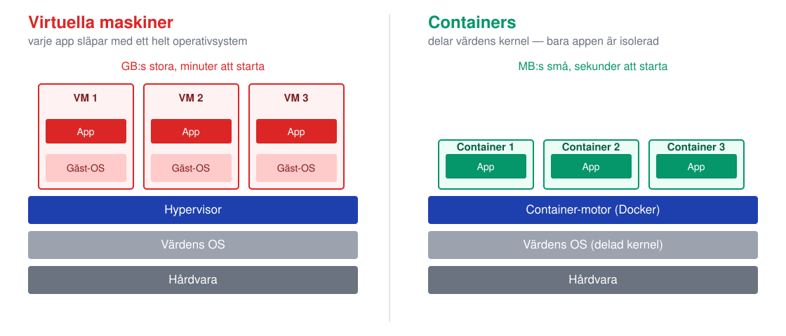
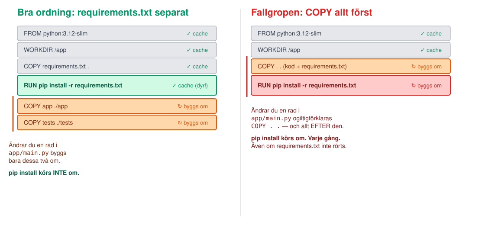

<!-- _class: lead -->
<!-- _footer: "" -->
<!-- _paginate: false -->

# Containers

## Session 3 · Images, Dockerfiles, docker compose, registries

Mjukvaruutvecklingsprocessen — DevOps
Arcada · 8.9–20.10.2026

---

## Läget: resultat från M2?

- Branch protection är på: en direkt push till `main` avvisas
- Minst en mergad PR per person — par: med godkänd review av buddyn · solo: med dokumenterad självgranskning i PR:en
- Commit med taggen `m2-review` är uppe på GitHub

**Fastnade du?** Fråga hjälp av läraren under labben. M1 och M2 är krav för M3.


---

## Agenda idag

1. Läget efter M2
2. **Föreläsning:** containers, images, Dockerfile, YAML, compose, registries
3. **M2**: Genomgång av M2
4. Paus
5. **Lab M3** — Dockerfiles, docker compose, push till GHCR
6. Wrap-up: verifiera M3, vanliga problem, nästa gång

---

<!-- _class: lead -->

# Del 1: Varför containers?

---

## "Det fungerar på min dator"

Grundproblemet: en app beror på **mer än sin egen kod** — Python-version,
installerade paket, miljövariabler, operativsystem. Allt det är osynligt
och olika på varje dator.

- En **container** paketerar appen **och hela dess körmiljö** i en enda fil
- Samma image körs **identiskt** på din bärbara, klasskompisens, byggservern
  och (från S7) en molnserver
- Det är precis samma problem Git löste för koden (M1–M2) — nu löser vi det
  för **allt som koden behöver för att köra**

---

## Containers eller virtuella maskiner



---

## Images och lager

En **image** är en stack av **read-only lager**, staplade ovanpå varandra —
inte en enda stor fil.

- Varje instruktion i en `Dockerfile` skapar (nästan alltid) **ett nytt
  lager**
- Lager är **cachade**: ändrar du inget i ett steg, återanvänder Docker
  det cachade lagret i stället för att göra om jobbet
- Ändrar du en rad i Dockerfilen byggs **det lagret och allt EFTER det**
  om — allt före förblir cachat

```bash
docker build -t template-app-backend ./backend
docker history template-app-backend   # se lagren med egna ögon
```

---

## Cache-fällan: ordning spelar roll



---

<style scoped>
section { font-size: 26px; }
</style>

## Dockerfile-anatomi: backend

Appens **riktiga** `backend/Dockerfile` — redan i ert repo sedan M1:

```dockerfile
FROM python:3.12-slim

# OS-patchning (hör till Spår C)
RUN apt-get update && apt-get -y upgrade && rm -rf /var/lib/apt/lists/*

WORKDIR /app

COPY requirements.txt .
COPY pyproject.toml .
RUN pip install --no-cache-dir -r requirements.txt

COPY app ./app
COPY tests ./tests

EXPOSE 8000

CMD ["uvicorn", "app.main:app", "--host", "0.0.0.0", "--port", "8000"]
```

---

## Dockerfile-anatomi: frontend

Appens **riktiga** `frontend/Dockerfile` — kortare, statisk nginx-server:

```dockerfile
FROM nginxinc/nginx-unprivileged:alpine

COPY nginx.conf /etc/nginx/conf.d/default.conf
COPY index.html style.css app.js /usr/share/nginx/html/

EXPOSE 8080
```

- **frontend-imagen** (`FROM nginxinc/nginx-unprivileged:alpine`) — ~90 MB
  mot **backend-imagen** ~340 MB
- Ingen `RUN`-rad: nginx **är** hela körmiljön
- Inget eget `CMD`: nginx-imagens **standard-CMD** startar servern
- **Icke-root** basimage — lyssnar på 8080, inte 80

---

<!-- _class: lead -->

# YAML på 5 minuter

## Allt ni behöver för resten av kursen

---

## YAML: indrag och kartor

- **Indrag ÄR syntax** — YAML har inga klamrar `{}` eller `end`, bara
  **mellanslag**. Fel indrag = fel struktur, eller ett fel som stoppar hela
  filen
- **Använd ALDRIG tabbar** — YAML-specen tillåter dem inte för indrag; de
  flesta editorer (VS Code inkluderat) kan ställas in att infoga
  mellanslag när du trycker Tab
- **`nyckel: värde`** är grundbygget — en karta (map) av namngivna fält

```yaml
tjänst:
  namn: backend
  port: 8000
```

---

## YAML: listor och citattecken

**Listor** börjar med `- ` (bindestreck + mellanslag), på samma indragsnivå:

```yaml
portar:
  - 8080
  - 8443
```

**Citera strängar** som annars kan misstolkas — klassikern är
**Norge-problemet**: `no`, `yes`, `on`, `off` (även `NO`, `Yes`, ...) tolkas
som **booleaner**, inte text, om de inte citeras:

```yaml
land: no        # blir booleanen false, INTE landskoden för Norge!
land: "no"      # rätt — nu är det texten "no"
```

---

## YAML: flerradiga strängar

Två sätt att skriva text över flera rader:

```yaml
literal: |
  Rad ett.
  Rad två.
  (radbryten bevaras exakt)

folded: >
  Rad ett.
  Rad två.
  (blir "Rad ett. Rad två." — radbrytningar blir mellanslag)
```

`|` när formatet spelar roll (skript, kommandon). `>` när det bara är löpande
text.

---

<!-- _class: lead -->

# Del 2: docker compose och registries

---

<style scoped>
section { font-size: 27px; }
</style>

## docker compose: hela appen, ett kommando

Appens riktiga `docker-compose.yml` — en YAML-karta av **tjänster**:

```yaml
services:
  backend:
    build: ./backend
    image: template-app-backend

  frontend:
    build: ./frontend
    image: template-app-frontend
    ports:
      - "8080:8080"
    depends_on:
      - backend
```

```bash
docker compose up --build   # bygg + starta båda tjänsterna
docker compose down         # stäng ner allt
```

---

## Registries: dela images

En **registry** är för images vad GitHub är för kod — ett ställe att
**pusha till** och **pulla från**, med versioner (taggar).

- CI bygger images med namnet
  `ghcr.io/<ert-användarnamn>/template-app-backend:<tagg>`
- Vi använder **GHCR** — samma GitHub-konto sedan M1, men en engångs-`docker login` med token (labben)
- Workflown `publish-images.yml` pushar redan images vid merge till
  `main`
- **Idag: för hand.** `docker login` + `docker tag` + `docker push`

```bash
docker tag template-app-backend:latest ghcr.io/<ert-användarnamn>/template-app-backend:latest
docker push ghcr.io/<ert-användarnamn>/template-app-backend:latest
```

---

<!-- _class: lead -->

# Lab: M3

## Dockerfiles · docker compose · push till GHCR

---

## M3 — dagens milstolpe

**Mål:** ni förstår appens Dockerfiles, hela appen kör med `docker
compose`, och båda images finns i GHCR.

1. **Läs och förutsäg:** gå igenom de befintliga Dockerfilerna rad för rad —
   förutsäg vad som händer INNAN ni kör, jämför med verkligheten
2. **Bygg och kör:** `docker compose up --build`, verifiera i webbläsaren
3. **Egen utökning:** lägg till `.dockerignore` för båda tjänsterna
4. **Registry:** logga in, tagga, pusha båda images till GHCR (manuellt)
5. Tagga: `git tag m3-container` — och pusha taggen

**Bevis:** appen kör via compose + båda images i GHCR + taggen uppe + osynligt arbete dokumenterat i `inlamning/m3-container.md`.

---

## Wrap-up: är M3 klar?

- [ ] `docker compose up --build` startar **båda** tjänsterna utan fel
- [ ] Appen svarar i webbläsaren på **localhost:8080**
- [ ] `.dockerignore` för båda tjänsterna finns, mergade via **granskad PR**
- [ ] Er egen `:latest`-push syns med **färsk tidsstämpel** för **båda** paketen
      (`template-app-backend`, `template-app-frontend`) under **Packages**
- [ ] Taggen `m3-container` syns under **Tags**, och det **osynliga arbetet** är dokumenterat i `inlamning/m3-container.md`

Fastnade du? Ta det **olöst** till session 4 — M1–M9 bör vara klara till session 10.

---

## Nästa gång

**Session 4 · fr 18.9 kl 13:00 — Automatisk testning**

Testpyramiden, `pytest`, `ruff`, coverage.

**Ta med:** ett M3-klart repo — containers ni förstår, images i GHCR.

> Idag paketerade ni appen. Nästa gång bevisar ni att den faktiskt gör rätt
> sak — automatiskt, varje gång.

