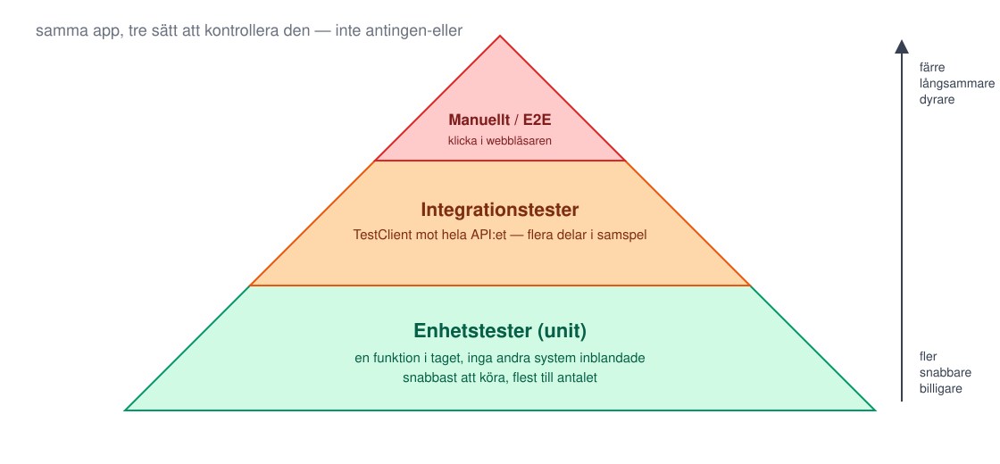
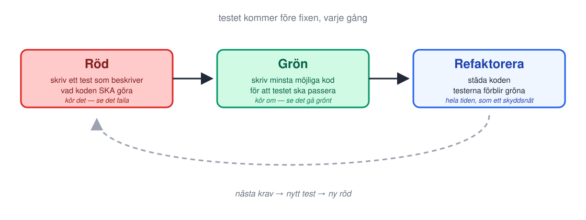

<!-- _class: lead -->
<!-- _footer: "" -->
<!-- _paginate: false -->

# Automatisk testning

## Session 4 · Testpyramiden, pytest, TestClient, red-green

Mjukvaruutvecklingsprocessen — DevOps
Arcada · 8.9–20.10.2026

---

## Läget: resultat från M3?

- `docker compose up --build` startar båda tjänsterna utan fel
- Båda images (`template-app-backend`, `template-app-frontend`) syns
  under **Packages** på GitHub
- Commit med taggen `m3-container` är uppe på GitHub

**Fastnade du?** Fråga hjälp av läraren under labben om det behövs.

---

## Agenda idag

1. Läget efter M3
2. **Föreläsning:** varför testa automatiskt, pytest, TestClient, red-green
3. Paus
4. **Lab M4** — bugjakt: bevisa en användares felrapport med ett test
5. Wrap-up: verifiera M4, genomgång, nästa gång

---

<!-- _class: lead -->

# Del 1: Varför automatisk testning?

---

## "Det ser rätt ut" räcker inte

En människa som klickar runt i en app kontrollerar **det hen råkar tänka
på** — inte varje kombination av steg, och inte varje gång koden ändras.

- Manuell testning är **långsam**: några minuter per genomgång, varje gång
- Manuell testning är **ofullständig**: ni hinner bara prova det ni kommer
  på just då
- Manuell testning är **inkonsekvent**: två personer klickar olika, samma
  person klickar olika en trött måndag
- Ett **automatiskt test** kör exakt samma kontroll, exakt lika, på under
  en sekund — hur många gånger som helst

**Senare idag bevisar ni det här på er egen app**, inte i teorin.

---

## Testpyramiden



---

## pytest-anatomi: TestClient

**Utdrag** ur appens riktiga `backend/tests/test_main.py` — redan i ert repo:

```python
from fastapi.testclient import TestClient
from app.main import app

client = TestClient(app)

def test_health() -> None:
    response = client.get("/api/health")
    assert response.status_code == 200
    assert response.json() == {"status": "ok"}
```

- `TestClient(app)` kopplar testet **direkt** mot appen — ingen server, ingen port
- Varje `test_`-funktion är **ett** test; `pytest` hittar dem automatiskt
- `assert` är kontrollen: "det här måste vara sant, annars failar testet"

---

## Arrange – act – assert

Samma tre steg i **varje** test — här `test_create_and_list_item`, också ur ert repo:

```python
def test_create_and_list_item() -> None:
    # arrange: skapa något att fråga om
    response = client.post("/api/items", json={"text": "buy milk"})
    assert response.status_code == 201
    created = response.json()

    # act: gör det testet handlar om
    response = client.get("/api/items")

    # assert: kom det jag stoppade in tillbaka?
    assert any(item["id"] == created["id"] for item in response.json())
```

```bash
docker compose run --rm --build backend pytest -q
```

---

## Läsa ett rött test: förväntat mot faktiskt

```text
>       assert response.json() == {"status": "okay"}
E       AssertionError: assert {'status': 'ok'} == {'status': 'okay'}
E         Differing items:
E         {'status': 'ok'} != {'status': 'okay'}
```

- **Vänster sida:** vad koden **faktiskt** svarade
- **Höger sida:** vad testet **förväntade** sig
- Läs **båda** — och bestäm er för **vilken sida som har fel** innan ni
  ändrar något. Här: testet (appen svarar `ok`, det är rätt)
- Ibland är det koden som har fel. Ibland är det testet. Ett rött test
  är en **fråga**, inte ett svar

---

## Vad ska man testa?

Tre sorters frågor till koden — en välbalanserad testsvit har alla tre:

- **Happy path:** gör det tänkta, kontrollera att svaret är rätt
- **Randfall:** tomt tillstånd, okänt id, tom eller väldigt lång sträng
- **Negativa fall:** fel indata — appen ska **avvisa** rätt, inte bara
  acceptera rätt

```python
def test_delete_missing_item_returns_404() -> None:
    response = client.delete("/api/items/999999")
    assert response.status_code == 404
```

---

## Testisolering: varje test börjar rent

Appens tillstånd (listan med anteckningar) ligger i **modulnivå**-variabler
— om ett test lämnar skräp efter sig, ärver nästa test det.

```python
import pytest
from app import main

@pytest.fixture(autouse=True)
def reset_state() -> None:
    main._items.clear()
    main._next_id = 1
```

- `autouse=True` — fixturen körs **automatiskt** före varje test
- Utan den: resultatet beror på **i vilken ordning** pytest råkar köra
  testerna — en bugg som bara syns ibland

---

## Red-green: skriv beviset innan du skriver fixen



**Rött** = buggen finns, bevisat · **Grönt efter fixen** = fixen fungerar, bevisat
· den **röda körningen** är bevis — spara den (`inlamning/m4-tests.md`)

---

## Kort om ruff och coverage

- **`ruff`** — samma linter som körts sedan M1 (`Lint and test
  backend`-checken i CI, obligatorisk från M5). Fångar stilbrott och
  vanliga buggmönster INNAN koden ens körs
- **Coverage** — mäter vilken **andel av kodraderna** som körs av
  testsviten, t.ex. `pytest --cov=app`
- **Hög coverage är INTE samma sak som korrekt kod** — en rad kan köras
  av ett test utan att testet kontrollerar rätt sak

```bash
docker compose run --rm --build backend pytest --cov=app
```

---

## Var körs testerna? Idag och sedan

- **Idag:** ni kör `pytest` **lokalt**, i er egen container, när ni själva
  väljer
- **Redan nu:** samma kommando körs **automatiskt** i GitHub Actions på
  **varje pull request** — `ci.yml` följde med template-repot från M1
- **Från session 5 (M5):** en röd körning **blockerar merge** — checken
  görs obligatorisk
- Samma test, samma kommando — bara **vem som trycker på knappen** ändras,
  från er till pipelinen

---

<!-- _class: lead -->

# Lab: M4

## Bugjakt — bevisa en användares felrapport med ett test

---

## En användare rapporterar

En kollega har shippat en **summeringsrad** under listan: antal anteckningar
och antal tecken totalt. PR:en granskades och mergades. Den kom med test.
Sviten är grön.

> *"Teckenräknaren visar fel värde efter att jag tagit bort en anteckning.
> Antalet anteckningar stämmer, men tecknen gör det inte."*

**Er uppgift, i den här ordningen:**

1. **Bevisa** felet — ett test som gör det användaren gjorde och blir **rött**
2. **Hitta orsaken** i koden — följ spåret från skärmen in i `main.py`
3. **Fixa** — samma test blir **grönt**, hela sviten grön

---

## Så får ni kollegans commit: `cherry-pick`

Ert repo skapades med *Use this template* — det delar **ingen historik**
med template-repot. Därför inte `merge`, inte `checkout` — utan:

```text
template-repo:  ● main ──── ● bughunt-m4   (kollegans feature, EN commit)
                                 │  git cherry-pick upstream/bughunt-m4
                                 ▼
ert repo:       ● Initial ── ● M1 ── ● M2 ── ● M3 ── ● bughunt-m4
                                        (main)         (samma ändring — ny commit i ER historik)
```

```bash
git switch main && git pull && git switch -c bughunt-m4
git remote add upstream https://github.com/Tobias-Eriksson/devops26-template
git fetch upstream && git cherry-pick upstream/bughunt-m4
git push -u origin bughunt-m4
```

Sedan **precis som varje annan ändring:** fixen går in i er `main` via en PR.

---

## M4 — dagens milstolpe

**Mål:** felet bevisat med ett rött test, fixat, grönt — och mergat.

1. Hämta kollegans commit (`cherry-pick`) — sviten grön innan start
2. Reproducera felrapporten **för hand** i appen: `milk`, `bread`, ta bort `bread`
3. Skriv testet i `tests/test_bugjakt.py` (finns redan) — samma steg — se det **rött**
4. Följ spåret: summeringsraden → API-adressen → koden. Varför stämmer ett tal, men inte det andra?
5. Fixa, se samma test **grönt** — och hela sviten
6. PR mot er `main` (M2-flödet) → review → merge → `git tag m4-tests` på `main`

**Regel:** ett påstående i chatten räknas inte — bara ett bevisande test:
rött→grönt + PR + taggen + `inlamning/m4-tests.md`.

---

## Wrap-up: är M4 klar?

Kör checklistan tillsammans:

- [ ] `docker compose run --rm --build backend pytest -q` är **grön** på `main`
- [ ] Ett test i `test_bugjakt.py` som **failade** på den ofixade koden
      finns i repot — och den **röda körningen** är sparad i `inlamning/m4-tests.md`
- [ ] Fixen är applicerad, samma test är nu **grönt**
- [ ] En **mergad PR** från `bughunt-m4` till `main` finns (granskad, eller
      dokumenterad självgranskning)
- [ ] Taggen `m4-tests` pekar på `main` efter mergen och syns under **Tags**

Fastnade du? Ta problemet **olöst** till session 5 — alla milstolpar bör
vara klara till session 10.

---

## Genomgång: vad hade stoppat buggen före `main`?

Tre skyddsnät passerade: **en granskare** läste diffen, **sviten** var grön,
**en människa** klickade. Vad saknades?

- **Ett test som täcker sekvensen** — skapa → ta bort → summera. Kollegans
  test skapade bara. En feature är inte testad förrän dess samspel med
  resten av appen är testat
- **Invarianten:** "summeringen ska **alltid** stämma med listan" — ett test
  som kontrollerar *det* fångar hela familjen av fel, inte bara det här
- **Skepsis mot sparade härledda värden:** ett tal som *också* finns någon
  annanstans måste hållas i synk vid **varje** ändring — för alltid.
  Räkna ut det när det efterfrågas, tills någon **mätt** att det är för dyrt

---

## Nästa gång

**Session 5 · on 23.9 kl 13:00 — CI del 1**

Pipelines som kod. **M5:** workflowen som redan kör lint + test på varje
PR blir obligatorisk — en röd pipeline blockerar merge.

**Ta med:** ett M4-klart repo — en grön testsvit ni litar på.

> Idag bevisade ni att appen gör rätt sak. Nästa gång ser ni till att ingen
> någonsin kan glömma att kontrollera det igen.

