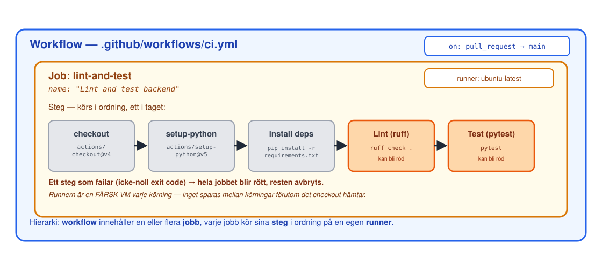

<!-- _class: lead -->
<!-- _footer: "" -->
<!-- _paginate: false -->

# CI del 1

## Session 5 · Pipelines som kod, GitHub Actions, röd blockerar merge

Mjukvaruutvecklingsprocessen — DevOps
Arcada · 8.9–20.10.2026

---

## Läget: resultat från M4?

- Sviten är **grön** på `main`
- Testet i `test_bugjakt.py` **failade** före fixen — röda körningen i `inlamning/m4-tests.md`
- En **mergad PR** från `bughunt-m4`
- Taggen `m4-tests` pekar på `main` efter mergen

**Fastnade du?** Fråga hjälp av läraren under labben om det behövs. M4
krävs inte för M5.

---

## Agenda idag

1. Läget efter M4
2. **Föreläsning:** varför CI, Actions-anatomi, appens riktiga ci.yml, branch protection möter CI
3. Genomgång av M4
4. Paus
5. **Lab M5** — obligatorisk check, röd PR blockeras, fixa, tagga
6. Wrap-up: verifiera M5, vanliga problem, nästa gång

---

<!-- _class: lead -->

# Del 1: Varför CI?

---

## "Det fungerar på min dator" — igen, men för processen

S3 löste det för **körmiljön**: samma image kör identiskt överallt.
Samma osynliga-tillstånd-problem finns för **kontrollerna** ni gör:

- "Jag körde testerna lokalt, de var gröna" — men på **er** dator, med
  **er** version av allt, **just nu**
- Kollegan som mergar er PR har inte kört något alls — de litar på att ni
  sa sanningen
- **CI kör exakt samma kommandon, på en identisk, färsk maskin, varje
  gång** — ingen "det var grönt hos mig" kvar att luta sig på

---

## Snabb feedback, och ett skyddat main

Två separata vinster, båda värda att säga högt:

- **Snabb feedback:** ett fel upptäcks på **minuter**, i PR:en, inte
  veckor senare när någon annan byggt vidare ovanpå det
- **Ett main som går att lita på:** om `main` alltid är grönt kan **vem
  som helst** basera nytt arbete på det utan att först kontrollera att
  det faktiskt fungerar
- Ju längre ett fel får leva innan det upptäcks, desto dyrare är det att
  reda ut — och desto svårare att komma ihåg **varför** koden såg ut
  som den gjorde

---

<!-- _class: lead -->

# Del 2: GitHub Actions-anatomi

---

## YAML, snabb påminnelse

S3 gick igenom YAML i detalj (indrag, kartor, listor) — `ci.yml` är
**samma språk**, bara ett nytt sammanhang:

```yaml
on:
  pull_request:
    branches: [main]
```

`on` är en karta med en nyckel (`pull_request`), som i sin tur är en
karta med en nyckel (`branches`), vars värde är en **lista** med ett
element. Samma indrag-är-syntax-regel som `docker-compose.yml`.

---

## CI-anatomi: workflow, job, steg, runner



---

## Genomgång: `ci.yml` — trigger och metadata

```yaml
name: CI
on:
  pull_request:
    branches: [main]

jobs:
  lint-and-test:
    name: Lint and test backend
    runs-on: ubuntu-latest
    defaults:
      run:
        working-directory: backend
```

- `jobs.lint-and-test` = YAML-**nyckel**, `name: "Lint and test backend"`
  = **texten** på check-statusen — inte samma sak
- `working-directory: backend` — alla `run`-steg nedan körs där

---

## Genomgång: `ci.yml` — stegen

```yaml
    steps:
      - uses: actions/checkout@v4
      - uses: actions/setup-python@v5
        with:
          python-version: "3.12"
      - name: Install dependencies
        run: pip install -r requirements.txt
      - name: Lint (ruff)
        run: ruff check .
      - name: Test (pytest)
        run: pytest
```

- `uses: ...` — färdig **action**. `run: ...` — eget skalkommando. Sista
  tre är **samma kommandon** som checken kört sedan M1 — `pytest` körde ni i M4
- Ordningen är avsiktlig: checkout → Python → pip install → ruff/pytest

---

## Triggers: när körs en workflow?

- `on: pull_request` — körs vid varje PR mot `main` (öppnas, ny commit
  pushas). **Det appen använder i dag.**
- `on: push` — körs vid varje commit på en given branch. **Det appens
  `publish-images.yml` redan använder** sedan M1 — ni jobbar med den i M6
- `on: workflow_dispatch` — en manuell "kör nu"-knapp i Actions-fliken.
  **Ni lägger till den själva i labben om en stund**
- En workflow kan lyssna på **flera** triggers samtidigt — de är en
  lista under `on`, inte antingen-eller

---

## Branch protection möter CI


---

## Röd pipeline blockerar merge

Så här ser det ut när checken är obligatorisk och en PR är röd:

- Merge-knappen på GitHub blir **grå och oklickbar**
- Texten ändras till något i stil med *"Merging is blocked — Required
  statuses must pass"*
- Klicka på checken → **Details** → hela loggen från runnern, exakt vad
  `ruff` eller `pytest` skrev ut

**Ingen genväg — förutsatt Enforcement status: Active från M2:** rulesets
bypass-lista är tom som standard, så spärren gäller alla, admins
inkluderat, av sig själv.

---

## Kort och ärligt: flaky och långsam CI

- En **flaky** check (failar ibland, utan att koden ändrats) är värre
  än ingen check alls — folk lär sig snabbt att **ignorera** röd och
  merga ändå, "för det brukar bara vara flaky"
- En **långsam** pipeline (10+ minuter) dödar den snabba feedbacken
  som var hela poängen — folk växlar till annat medan de väntar och
  tappar tråden
- Appens `ci.yml` är medvetet **litet och snabbt** (under en minut) — håll
  det så längre in i kursen också

---

<!-- _class: lead -->

# Lab: M5

## Obligatorisk check, röd PR blockeras, fixa, tagga

---

## M5 — dagens milstolpe

<style scoped>section { font-size: 27px; }</style>

**Mål:** checken obligatorisk, röd PR blockerad → grön merge, egen ändring i `ci.yml`.

1. **Require status checks to pass** + välj `Lint and test backend` 📸
2. PR med ett medvetet `ruff`-fel — merge-knappen låses, granska nu 📸
3. Fixa felet, se checken bli grön, merga
4. `workflow_dispatch:` i `ci.yml` via egen PR → **Run workflow** 📸
5. Skärmdumparna + `inlamning/m5-ci.md` via PR — kontrollera `main`, tagga då: `git tag m5-ci` och pusha

**Par:** en gör steg 2–3, den andra steg 4. **Solo:** radkommentar i stället för approve.

---

## Wrap-up: är M5 klar?

Kör checklistan tillsammans:

- [ ] **Require status checks to pass** är på (`Lint and test backend`)
- [ ] En röd PR har bevisligen **blockerat** merge-knappen
- [ ] Samma PR är fixad och mergad **grön**
- [ ] `ci.yml` har `workflow_dispatch:`, mergad via egen PR — en **manuell** körning syns i **Actions**
- [ ] **I par:** båda har en egen mergad PR
- [ ] Skärmdumparna finns i `inlamning/m5-ci.md` på `main`, och taggen `m5-ci` pekar på `main`

Fastnade du? Ta det **olöst** till session 6 — M1–M9 bör vara klara till session 10.

---

## Nästa gång

**Session 6 · fr 25.9 kl 13:00 — CI del 2**

Artefakter, secrets, taggning. **M6:** `publish-images.yml` — som byggt
och pushat images vid varje merge sedan M1 — blir er egen: ni ändrar i
den och följer hela kedjan fram till en pullbar image.

**Ta med:** ett M5-klart repo — en pipeline ni litar på och som faktiskt
stoppar er när ni gör fel.

> I dag blev det tekniskt omöjligt att glömma en kontroll. Nästa gång
> tar ni över maskineriet som redan bygger och publicerar åt er.

