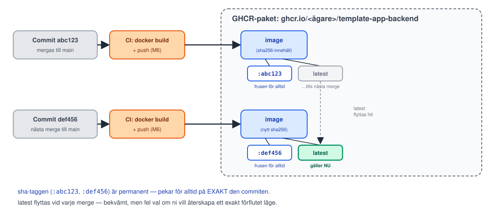

<!-- _class: lead -->
<!-- _footer: "" -->
<!-- _paginate: false -->

# CI del 2

## Session 6 · Artefakter, secrets, taggning

Mjukvaruutvecklingsprocessen — DevOps
Arcada · 8.9–20.10.2026

---

## Läget: resultat från M5?

- `Lint and test backend` är **obligatorisk** i rulesetet
- En medvetet röd PR **blockerade** merge-knappen — sedan fixad och mergad grön
- `ci.yml` har `workflow_dispatch:` via egen PR — en **manuell** körning syns i **Actions**
- **I par:** båda har en egen mergad PR
- 3 skärmdumpar i `inlamning/m5-ci.md` på `main`; taggen `m5-ci` pekar på `main`

**Fastnade du?** Fråga hjälp av läraren under labben om det behövs. M4
krävs inte för M6 — men **M5 måste vara klart:** dagens PR:er går igenom
samma spärr.

---

## Agenda idag

1. Läget efter M5
2. **Föreläsning:** artefakter & registries, appens riktiga publish-images.yml, secrets ärligt, synlighetsfällan
3. Paus
4. **Lab M6** — egen ändring, verifiera automatiken, publika paket, pull, secrets-övning, tagga
5. Wrap-up: verifiera M6, vanliga problem, nästa gång

---

<!-- _class: lead -->

# Del 1: Build-artefakter & registries

---

## Imagen ÄR den distribuerbara artefakten

- Källkoden i repot är **receptet**. Imagen som byggs av den är **den
  faktiska produkten** — exakt de byte som körs, oavsett var
- Samma tanke som en `.jar`, en `.whl` eller ett kompilerat binärt paket
  i andra ekosystem — bara paketerat som ett filsystem + startkommando
  i stället för en enda fil
- En **registry** (GHCR) är för artefakter vad GitHub är för källkod:
  ett ställe att pusha till och pulla från, med versioner

---

## sha vs latest: taggning och spårbarhet



---

## Från M3 till idag: samma jobb, nu automatiskt

> "Workflown `publish-images.yml` pushar redan images vid merge till
> `main` … **Idag: för hand.**"
>
> — Session 3, om `docker login` + `docker tag` + `docker push`

Det ni gjorde för hand i M3 (logga in, tagga, pusha) är **exakt** vad
`publish-images.yml` gör åt er nu, vid varje merge till `main`.

---

<!-- _class: lead -->

# Del 2: Genomgång av `publish-images.yml`

---

## Genomgång: trigger och rättigheter

```yaml
name: Publish images

on:
  push:
    branches: [main]

permissions:
  contents: read
  packages: write
```

- `on: push` (inte `pull_request`) — körs vid varje commit **på main**,
  dvs. varje mergad PR. Skiljer sig medvetet från `ci.yml`
- `permissions`-blocket är **least-privilege**: exakt `contents: read`
  (checka ut koden) + `packages: write` (pusha images) — inget annat

---

## Genomgång: inloggning och taggning

```yaml
    steps:
      - name: Log in to GHCR
        uses: docker/login-action@v3
        with:
          registry: ghcr.io
          username: ${{ github.actor }}
          password: ${{ secrets.GITHUB_TOKEN }}
      - name: Build and push
        uses: docker/build-push-action@v5
        with:
          tags: |
            ghcr.io/.../template-app-backend:latest
            ghcr.io/.../template-app-backend:${{ github.sha }}
```

- Inloggning med `secrets.GITHUB_TOKEN` — ingen sparad PAT
- `${{ github.sha }}` är EXAKT den sha-tagg förra slidens diagram visade

---

<!-- _class: lead -->

# Secrets, ärligt

---

## GITHUB_TOKEN vs Personal Access Token

I M3 loggade ni in med en **PAT** ni själva skapade. Idag använder
workflowen **`GITHUB_TOKEN`**. Skillnaden är hela poängen:

| | PAT (M3) | GITHUB_TOKEN (M6) |
|---|---|---|
| Vem skapar den | Ni, manuellt | GitHub, automatiskt |
| Livslängd | Tills ni själva återkallar den | En körning, sedan död |
| Lagras var | `docker login`, er codespace/dator | Ingenstans ni ser |
| Rättigheter | Det scope ni klickade i | Exakt `permissions`-blocket |
| Läcker den | Fungerar tills återkallad | Redan oanvändbar |

---

## Vad hör hemma i Secrets, vad hör hemma i vars

- **Secrets** (Settings → Secrets and variables → Actions → Secrets):
  allt som är känsligt om det läcker — tokens, lösenord, API-nycklar.
  Krypterat, aldrig synligt i loggen i klartext (mer om det strax)
- **Variables** (samma meny, fliken **Variables**): allt annat
  konfigurerbart som INTE är känsligt — en miljö-URL, ett feature-flag,
  ett versionsnummer. Synliga i klartext, enklare att felsöka
- Tumregel: skulle ni bry er om värdet läckte i en offentlig logg? Ja →
  secret. Nej → variable

---

## Rotation: en secret som aldrig byts är redan farlig

- En secret som aldrig roteras är, den dag den läcker, en secret som
  har varit giltig sedan **dag ett** — ingen vet hur länge den redan
  legat exponerad innan någon märker det
- `GITHUB_TOKEN` behöver **aldrig** roteras för hand — GitHub gör det
  åt er automatiskt, varje enskild körning
- PAT:er och andra long-lived secrets behöver en **påminnelse** — t.ex.
  var 90:e dag — annars är det bara tur som avgör hur länge en gammal
  token ligger kvar och fungerar

---

## Vad ett läckage ser ut som — och GitHubs skyddsnät

- Vanligast: en secret hamnar av misstag i en committad fil (`.env`
  glömt i `git add .`, en nyckel klistrad rakt in i kod)
- **Push protection** stoppar er INNAN pushen ens går igenom, om
  GitHub känner igen mönstret på ett vanligt secret-format (AWS-nycklar,
  API-tokens m.fl.) — en röd varning i terminalen/webben, pushen avvisas
- **Secret scanning** letar igenom hela historiken (även gamla commits)
  efter kända mönster och varnar repo-ägaren om något redan smugit sig
  in
- Båda är **på som standard** för publika repon (som ert kursrepo) —
  ni har redan skyddsnätet, ni behöver bara veta att det finns

---

## Loggen ljuger inte om ni provar: masking

Kör ni av misstag `echo` på en secret i en workflow, skriver GitHub
Actions **inte** ut värdet — loggen visar `***` i stället:

```yaml
- run: echo "${{ secrets.GITHUB_TOKEN }}"
```

```
***
```

Det här testar ni **på riktigt**, på er egen ogranskade branch, i
labben om en stund.

---

## Varför övningen är säker — och var gränsen går

- Säkert **här**, av tre skäl: `GITHUB_TOKEN` **maskeras** i loggen, den
  **dör med jobbet** — även om maskeringen missade något finns tokenen
  inte kvar att missbruka minuten efter — och körningen **pushar
  ingenting**, samma `push`-guard som förra slidens genomgång
- **Reflexen att testa samma sak med en riktig, långlivad secret (en
  PAT, en molnnyckel) är farlig** — maskering är ett skyddsnät mot
  MISSTAG i loggen, inte en garanti, och en långlivad secret som läcker
  fortsätter fungera långt efter att ni glömt bort testet
- Regeln görs alltså inte om av lathet i produktion: testa gärna
  loggbeteende, men bara med en secret vars livslängd redan är räknad
  i minuter

---

## Synlighetsfällan: privat paket som standard

Första gången workflowen pushar en image skapas GHCR-paketet **privat**.
Det betyder:

- `docker pull` utan inloggning svarar **`denied`** — inklusive från en
  molnserver som inte är inloggad
- Det ser ut som ett nätverks- eller behörighetsfel, men är bara fel
  **synlighet** på paketet
- Fixas i **Package settings → Change visibility → Public** — labben om
  en stund, och samma steg blir en förutsättning för M7:s manuella pull
  och M8:s cloud-init-pull

---

<!-- _class: lead -->

# Lab: M6

## Egen ändring, verifiera automatiken, publika paket, pull, secrets

---

## M6 — dagens milstolpe

<style scoped>section { font-size: 26px; }</style>

**Mål:** egen ändring i `publish-images.yml` mergad, automatiken bevisad end-to-end, publika paket, pull utan inloggning.

1. Läs `publish-images.yml` mot `ci.yml` — trigger, `permissions`, taggar
2. `workflow_dispatch:` + spårbarhetssteg via egen PR → merga
3. Mergen triggar **Publish images** — Summary visar taggarna 📸, kör **Run workflow** 📸
4. Båda GHCR-paketen **Public** 📸
5. `docker logout` + `docker pull` utan inloggning → `/api/health` svarar 📸
6. Secrets-övning på ogranskad branch — `***` i loggen 📸, radera branchen, **mergas aldrig**
7. Skärmdumparna + `inlamning/m6-cd-images.md` via PR — kontrollera `main`, tagga då: `git tag m6-cd-images` och pusha

**Par:** en gör steg 2, den andra steg 6–7. **Solo:** radkommentar i stället för approve.

---

## Wrap-up: är M6 klar?

<style scoped>section { font-size: 27px; }</style>

Kör checklistan tillsammans:

- [ ] `publish-images.yml`: `workflow_dispatch:` + spårbarhetssteg, mergad via egen PR
- [ ] Mergen triggade `Publish images` grönt; en **manuell** körning syns i **Actions**
- [ ] Paketen **publika**; `docker pull` **utan** inloggning svarade på `/api/health`
- [ ] `GITHUB_TOKEN` sett som `***` — debug-branchen **raderad**, aldrig mergad
- [ ] **I par:** båda har en egen mergad PR
- [ ] `inlamning/m6-cd-images.md` på `main`, och taggen `m6-cd-images` pekar på `main`

Fastnade du? Ta det **olöst** till session 7 — M1–M9 bör vara klara till session 10.

---

## Nästa gång

**Session 7 · ti 29.9 kl 13:00 — Molnet manuellt**

OpenStack-begrepp, VM i Pouta-UI:t, security groups, SSH, Docker.
**M7:** appen svarar på en riktig floating-IP/nip.io-URL — för första
gången någon annanstans än er egen dator.

**CSC-projektet:** ert eget CSC-projekt ska vara klart före tisdag — båda i
paret medlemmar i MyCSC, cPouta aktiverat, båda kommer in på
pouta.csc.fi. Roller och lika rättigheter diskuterar vi på S7.

**Ta med:** ett M6-klart repo — en pipeline som testar, bygger OCH
publicerar helt automatiskt.

