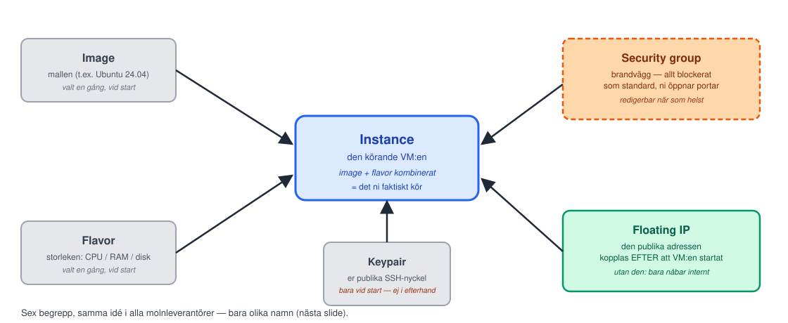
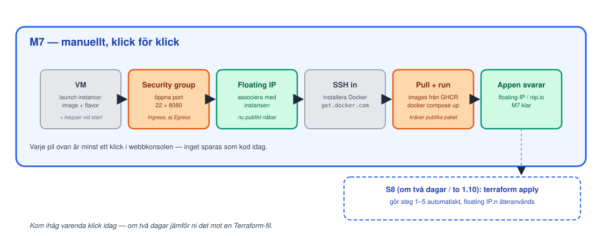

<!-- _class: lead -->
<!-- _footer: "" -->
<!-- _paginate: false -->

# Molnet manuellt

## Session 7 · OpenStack, CSC cPouta, SSH, M7

Mjukvaruutvecklingsprocessen — DevOps
Arcada · 8.9–20.10.2026

---

## Läget: resultat från M6?

- `publish-images.yml`: `workflow_dispatch:` + spårbarhetssteg via egen PR
- Mergen triggade `Publish images` grönt; en **manuell** körning syns i **Actions**
- Paketen **publika**; `docker pull` **utan** inloggning svarade på `/api/health`
- `GITHUB_TOKEN` sett som `***` — debug-branchen **raderad**, aldrig mergad
- **I par:** båda har en egen mergad PR
- 5 skärmdumpar i `inlamning/m6-cd-images.md` på `main`; taggen `m6-cd-images` pekar på `main`

**Fastnade du?** Fråga läraren under labben. Men **M6 steg 4 måste vara
klart:** VM:ens `docker compose pull` kräver publika paket — fixa det före paus.

---

## Agenda idag

1. Läget efter M6
2. **Föreläsning:** varför moln, molnmodeller, OpenStack-begrepp, cPouta konkret, SSH-nycklar
3. Paus
4. **Lab M7** — VM i Pouta-UI:t, security group, floating IP, SSH, Docker, appen live
5. Wrap-up: verifiera M7, vanliga problem, nästa gång

---

<!-- _class: lead -->

# Del 1: Varför moln?

---

## Från laptop till produktion

- Hittills har "kör appen" betytt `docker compose up` **på er egen
  dator** — den svarar bara medan datorn är på och ni sitter vid den
- **Produktion** betyder att appen svarar **åt någon annan, när ni inte
  är där** — mitt i natten, från vilken dator som helst, imorgon när er
  laptop är avstängd
- Skillnaden är inte kod. Det är **var** koden kör: en dator som alltid
  är på, har en riktig internetadress, och som ni inte äger fysiskt

> "**M7:** appen svarar på en riktig floating-IP/nip.io-URL — för första
> gången någon annanstans än er egen dator."
> — Session 6, Nästa gång

---

## Molnmodeller: IaaS, PaaS, SaaS

| Modell | Vad ni hanterar | Exempel |
|---|---|---|
| **IaaS** (Infrastructure) | OS uppåt: paket, Docker, er app | **CSC cPouta** (dagens/M7–M9) |
| **PaaS** (Platform) | Bara koden — plattformen sköter OS, skalning | CSC Rahti/OpenShift (spår B), Heroku |
| **SaaS** (Software) | Inget — ni är bara användare | Gmail, GitHub självt |

- Ju högre upp, desto mindre kontroll men mindre att underhålla
- Kursens grund (M7–M9) ligger på **IaaS** — ni ser hela stacken,
  inklusive det jobbiga. Spår B (ett av final taskens spår, väljs i
  session 10) visar PaaS-nivå på samma app

---

<!-- _class: lead -->

# Del 2: OpenStack-begrepp

---

## Sex begrepp, en VM

---

## Samma idé, olika namn

| OpenStack (cPouta) | AWS | Azure |
|---|---|---|
| Image | AMI | VM image |
| Flavor | Instance type | VM size |
| Instance | EC2 instance | Virtual machine |
| Security group | Security group | Network security group |
| Keypair | Key pair | SSH public key |
| Floating IP | Elastic IP | Public IP address |

Nämns **en gång**, för överförbarheten — kursen använder OpenStack-
termerna hädanefter, samma koncept oavsett leverantör.

---

## CSC cPouta, konkret

- Ni har ett **eget CSC-projekt** — ett per par, båda medlemmar via **Haka** —
  ordnat efter session 1, ingen ny ansökan idag
- Webbkonsolen: **pouta.csc.fi** → logga in med Haka → välj ert projekt
- Horizon (OpenStacks webb-UI) — begreppen från "Sex begrepp, en VM" som
  menyer: **Compute → Instances / Key Pairs**, **Network → Security Groups /
  Floating IPs**
- Alla medlemmar har **samma fulla rättigheter** — ingen "får bara titta"-roll;
  det som skyddar er VM är namngivning och överenskommelser, inte systemet
- Labben (`labs/m7-cloud-vm.md`) är en numrerad guide genom exakt de klicken

---

<!-- _class: lead -->

# SSH-nycklar

---

## ed25519, agent, och en regel som aldrig bryts

- **Var och en av er** skapar ett eget nyckelpar, med lösenfras:
  `ssh-keygen -t ed25519 -C "din@epost" -f ~/.ssh/cpouta_ed25519` —
  **ed25519** är dagens rekommenderade algoritm (kortare, snabbare,
  minst lika säker som äldre RSA-nycklar)
- Två filer: `cpouta_ed25519` (**privat**) och `cpouta_ed25519.pub`
  (**publik**)
- Den **publika** nyckeln laddar ni upp till cPouta (Key Pairs) — den
  får finnas överallt, det är designen
- **Regeln som aldrig bryts:** den privata nyckeln lämnar aldrig er
  kontroll. Aldrig uppladdad (inte ens till CSC), inte i chatten, inte i
  ett repo, inte till par-kompisen — den ÄR er identitet mot servern

---

## Två i paret, en VM — utan att dela privat nyckel

- Vid start injicerar OpenStack **en** nyckel — den ena partnerns
- Direkt efter första inloggningen (labbens steg 7) lägger ni till den
  andras **publika** nyckel på VM:en:
  `echo '<partnerns .pub>' >> ~/.ssh/authorized_keys`
- **Redundans:** tappar en sin nyckel loggar den andra in och lägger till
  en ny — ny VM krävs bara om BÅDA nycklarna är borta
- Samma mekanik som M9:s deploy-användare: åtkomst ges genom att lägga
  till publika nycklar

---

<!-- _class: lead -->

# M7-flödet: helt manuellt

---

## Kom ihåg varenda klick

---

## Nip.io: en URL utan att äga en domän

- Er floating IP är bara en siffersträng (t.ex. `195.148.X.Y`) — funkar
  fint för `curl`, men känns inte som "en riktig produkt"
- **nip.io** är en gratis tjänst som översätter en IP inbäddad i ett
  domännamn tillbaka till samma IP — inget konto, ingen registrering
- Mönster: byt punkterna i er IP mot bindestreck, lägg till
  `.nip.io`: `195.148.X.Y` → `http://195-148-X-Y.nip.io:8080`
- Ingen DNS-registrering krävs — det är samma IP hela tiden, bara ett
  läsbart namn runt den

---

<!-- _class: lead -->

# Lab: M7

## VM för hand · security group · floating IP · SSH · Docker · appen live

---

## M7 — dagens milstolpe

**Mål:** appen svarar på floating-IP/nip.io-URL **utifrån** — för första gången utanför er egen arbetsmiljö.

1. Steg 1–2: eget nyckelpar var (`cpouta_ed25519`, lösenfras), publika nyckeln till **Key Pairs** 📸
2. Steg 3–5 [KONSOL]: security group 22 + 8080 **Ingress** 📸, Launch Instance (`standard.small`), floating IP 📸
3. Steg 6–8: SSH in, partnerns publika nyckel i `authorized_keys`, Docker via `get.docker.com`
4. Steg 9–10: compose-filen på VM:en, `pull` + `up -d`, `curl` utifrån 📸 + nip.io i webbläsaren 📸
5. Steg 11: skärmdumparna + `inlamning/m7-cloud.md` via PR — kontrollera `main`, tagga då: `git tag m7-cloud` + push

**Par:** en klickar konsolen (2–5), den andra tar VM:en (8–10) + PR:en. **Solo:** hoppa över steg 7, radkommentar i stället för approve.

---

## Wrap-up: är M7 klar?

Kör checklistan tillsammans:

- [ ] VM körs i cPouta, security group tillåter port 22 + 8080, floating IP associerad
- [ ] SSH in fungerar med egen nyckel — **i par:** för er BÅDA
- [ ] Båda containrarna kör (`sudo docker compose -f /opt/app/docker-compose.yml ps`)
- [ ] `curl` mot floating-IP:n svarar **utifrån** (codespace eller egen dator); nip.io-URL:en visar appen i en **webbläsare**
- [ ] 5 skärmdumpar i `inlamning/m7-cloud.md` på `main` via egen PR — och taggen `m7-cloud` pekar på `main`

Fastnade du? Ta det **olöst** till session 8 — M1–M9 bör vara klara till session 10.

---

## Nästa gång

**Session 8 · to 1.10 kl 09:15 — Infrastructure as Code**

Deklarativt, state, idempotens. **M8:** Terraform återskapar hela M7
från noll — VM, security group, keypair, floating IP, cloud-init som
installerar Docker automatiskt. Riv & bygg om (floating IP:n återanvänds).

**Ta med:** en fungerande M7-VM och en tydlig känsla av varenda
inställning ni klickade idag — ni kommer jämföra den mot en Terraform-fil
om två dagar.

