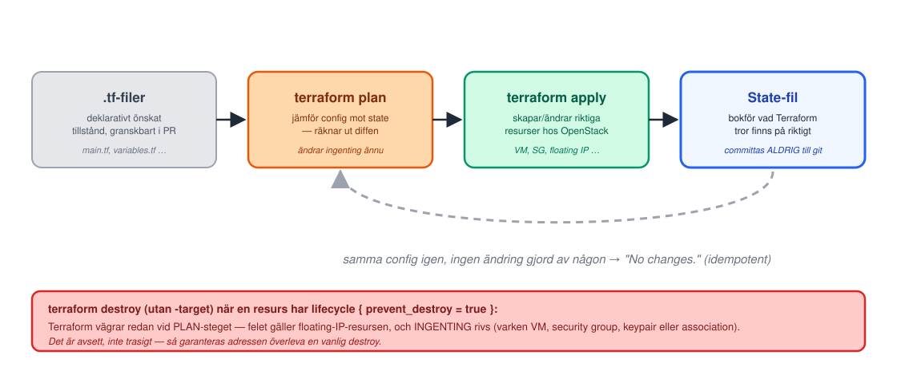

<!-- _class: lead -->
<!-- _footer: "" -->
<!-- _paginate: false -->

# Infrastructure as Code

## Session 8 · Terraform, state, idempotens, M8

Mjukvaruutvecklingsprocessen — DevOps
Arcada · 8.9–20.10.2026

---

## Läget: resultat från M7?

<style scoped>section { font-size: 27px; }</style>

- VM körs i cPouta, security group tillåter port 22 + 8080, floating IP associerad
- SSH in fungerar med egen nyckel — **i par:** för er BÅDA
- Båda containrarna kör (`sudo docker compose -f /opt/app/docker-compose.yml ps`)
- `curl` mot floating-IP:n svarar **utifrån**; nip.io-URL:en visar appen i en **webbläsare**
- 5 skärmdumpar i `inlamning/m7-cloud.md` på `main` via egen PR — och taggen `m7-cloud` pekar på `main`

**Fastnade du?** Fråga läraren under labben. Dagens lab bygger om M7 som
kod och river sedan M7-VM:en — en ofärdig M7 är inget hinder (hoppa över
steg 6), men M7:s skärmdumpar måste vara tagna **före** rivningen.

---

## Agenda idag

1. Läget efter M7
2. **Föreläsning:** varför IaC, Terraform-modellen, state, den riktiga modulen
3. Paus
4. **Lab M8** — bygg om med Terraform, riv M7-VM:en permanent, verifiera samma IP (rebuild-demot)
5. Wrap-up: verifiera M8, vanliga problem, nästa gång

---

<!-- _class: lead -->

# Del 1: Varför Infrastructure as Code?

---

## Snowflake-servrar vs reproducerbar infra

- Er M7-VM är en **snowflake-server**: unik, byggd genom en serie
  handklick som ingen skrev ner fullständigt och som ingen kan
  återupprepa exakt — inte ens ni själva, en vecka senare
- Glömde ni en security group-regel? En flavor-inställning? Det syns
  inte förrän något går sönder, och ingen diff visar VAD som skiljer
  VM:en från den ni TÄNKTE bygga
- **Infrastructure as Code (IaC):** samma idé som redan styr er kod —
  beskriv önskat tillstånd i filer, låt ett verktyg räkna ut och utföra
  ändringen, granska ändringen i en PR precis som vilken kodändring
  som helst

---

## Löftet från i tisdags

> "**M8:** Terraform återskapar hela M7 från noll — VM, security group,
> keypair, floating IP, cloud-init som installerar Docker automatiskt.
> Riv & bygg om (floating IP:n återanvänds)."
> — Session 7, Nästa gång

Idag håller vi det löftet: samma VM, samma security group, samma
floating IP, samma Docker-installation — beskrivna i en enda liten
Terraform-modul i stället för en sekvens klick ingen kan bevisa i efterhand.

---

<!-- _class: lead -->

# Del 2: Terraform-modellen

---

## Deklarativt, inte imperativt

- **Imperativt** (det ni gjorde i M7, och det mesta skriptande):
  beskriv STEGEN — "skapa en VM", "öppna port 22", "associera en IP" —
  i en viss ordning
- **Deklarativt** (Terraform): beskriv SLUTRESULTATET — "det ska finnas
  en VM med dessa egenskaper" — och låt verktyget räkna ut stegen
- Terraform jämför er beskrivning (`.tf`-filerna) mot vad som faktiskt
  finns, och räknar ut diffen: vad ska skapas, ändras, eller rivas för
  att verkligheten ska matcha filerna

---

## Livscykeln: plan → apply → destroy



---

## State-filen: ärligt talat

- `terraform.tfstate` är en JSON-fil som håller reda på **vad Terraform
  tror finns** — resurs-ID:n, aktuella attributvärden, allt
- **Ni committar den ALDRIG till git** — den kan innehålla känsliga
  värden (IP-adresser, ibland lösenord) och den ändras vid varje
  `apply`, vilket ger ständiga merge-konflikter i ett delat repo
- **Om ni tappar state-filen:** Terraform "glömmer" att resurserna finns
  — nästa `apply` vill skapa allt på nytt (dubbletter, krockande namn)
  även om VM:en fortfarande kör i molnet. Det går att återskapa state
  manuellt (`terraform import`), men det är långsamt och felbenäget —
  state är inte valfritt att ta hand om

---

<!-- _class: lead -->

# Del 3: Den riktiga modulen

---

## main.tf, resurs för resurs

```hcl
resource "openstack_compute_keypair_v2" "this" { ... }

resource "openstack_networking_secgroup_v2" "this" { ... }
resource "openstack_networking_secgroup_rule_v2" "ssh" { ... }
resource "openstack_networking_secgroup_rule_v2" "app" { ... }

resource "openstack_networking_port_v2" "this" { security_group_ids = [...] }

resource "openstack_networking_floatingip_v2" "this" {
  lifecycle { prevent_destroy = true }
}

resource "openstack_compute_instance_v2" "this" {
  user_data = templatefile("${path.module}/../cloud-init/user-data.yaml.tpl", { ... })
}

resource "openstack_networking_floatingip_associate_v2" "this" { ... }
```

---

## Varför porten och floating IP:n är egna resurser

<style scoped>section { font-size: 27px; }</style>

- Floating IP:n knyts till VM:ens **nätverksport**
  (`openstack_networking_port_v2`) via en **separat**
  `openstack_networking_floatingip_associate_v2`-resurs — inte till
  instansen. VM:en lånar bara porten
- Det betyder att VM:en kan rivas och byggas om **utan att röra port,
  association eller floating-IP-resurs** — de lever kvar i state hela
  tiden, med `lifecycle { prevent_destroy = true }` på adressen som
  extra skydd — även den interna fixed IP:n kommer tillbaka
- Motivet är inte estetiskt: cPouta har **begränsad kvot** på floating
  IPs per projekt. En tappad adress måste allokeras på nytt och kan bli
  en ANNAN — det är precis det M8:s rebuild-demo bevisar att inte
  händer

---

## cloud-init: samma steg, nu automatiska

- `user_data = templatefile("${path.module}/../cloud-init/user-data.yaml.tpl", { ghcr_owner = var.ghcr_owner })`
- Det är **samma tre steg** ni körde för hand i M7 (`curl -fsSL
  https://get.docker.com | sh`, skriv `docker-compose.yml`, `docker
  compose up -d`) — nu beskrivna i en fil och injicerade av Terraform
  vid VM:ens FÖRSTA uppstart, helt utan SSH-inloggning
- `templatefile()` renderar `${ghcr_owner}`-platshållaren i filen till
  ert riktiga GHCR-namn innan den skickas till OpenStack som
  cloud-init-payload

---

## variables.tf & outputs.tf

- **Variabler utan default** (`network_name`, `ghcr_owner`) är
  projekt-specifika — Terraform VÄGRAR köra `apply` förrän ni satt dem
  i en `terraform.tfvars`-fil (aldrig committad, precis som `clouds.yaml`)
- **Variabler med default** (`image_name`, `flavor_name`,
  `app_port` …) fungerar direkt på cPouta utan att ni rör dem — utom
  `instance_name`: sätt ett eget värde (`m8-<förnamn>`, som i M7) — så
  syns vems VM, security group och keypair som är vems i Horizon
- **Outputs** efter `apply`: `floating_ip`, `ssh_command`, `app_url`,
  `app_url_nip_io` — samma "floating-IP/nip.io-URL"-språk som M7 använde,
  fast nu utskrivet automatiskt i terminalen i stället för att ni själva
  bygger URL:en för hand

---

## clouds.yaml: autentisering, aldrig i .tf-filer

- Terraform pratar med OpenStack via **`clouds.yaml`**, precis som
  OpenStack-CLI:t — inga lösenord eller projekt-ID:n hårdkodas i någon
  `.tf`-fil
- Skapa en **application credential** (**Identity → Application
  Credentials**, roll `member`) och ladda ner dess **clouds.yaml** till
  `~/.config/openstack/clouds.yaml` — i **hemkatalogen**, även i
  codespacen. Inget CSC-lösenord i filen, men **committas ALDRIG**
- Sätt `OS_CLOUD` till namnet under `clouds:` i er fil innan ni kör
  Terraform — providerblocket i koden är medvetet tomt och läser detta
  från miljön

---

## Idempotens: kör samma kommando igen

- Kör `terraform apply` en gång till, utan att ändra en enda rad kod:
  Terraform svarar **`No changes. Your infrastructure matches the
  configuration.`**
- Det är HELA poängen med deklarativ infra: samma kommando, kört hur
  många gånger som helst, ger samma resultat — till skillnad från M7
  där varje handklick var en engångshändelse ingen kunde bevisa var
  identisk med förra gången
- Jämför med `docker compose up -d` (M7, och cloud-init) — samma idempotenta idé,
  bara på infrastrukturnivå i stället för containernivå

---

<!-- _class: lead -->

# M8: riv & bygg om

---

## Rebuild-demot: VM:en rivs, IP:n stannar

```bash
terraform destroy -target=openstack_compute_instance_v2.this

terraform apply
```

Bara VM:en rivs och byggs om — porten, associationen och
floating-IP-resursen rörs aldrig, och `floating_ip`-outputen visar
**samma adress** efteråt.

---

## Och en vanlig `terraform destroy`, utan `-target`?

Floating-IP-resursen har `lifecycle { prevent_destroy = true }`.

**Terraform vägrar redan vid PLAN-steget** med ett fel på
floating-IP-resursen — **INGENTING rivs**: inte VM:en, inte security
groupen, inte keypairen, inte associationen.

Det är **avsett, inte trasigt**: hela kommandot avbryts innan det rör
en enda resurs, just för att garantera att adressen aldrig försvinner
av misstag (t.ex. i CI, eller ett skript någon kör halvsovande).

---

<!-- _class: lead -->

# Lab: M8

## Terraform bygger om M7 · riv M7-VM:en · rebuild med samma floating IP

---

## M8 — dagens milstolpe

<style scoped>section { font-size: 24px; }</style>

**Mål:** samma resultat som M7 — appen svarar på floating-IP/nip.io-URL — men byggt av `terraform apply`.

1. Steg 1–3: credential → `clouds.yaml` + `OS_CLOUD`, `terraform.tfvars`, `fmt`/`validate`
2. Steg 4–5 [CLOUD]: `init`/`plan`/`apply` → `8 added` 📸, `curl` utifrån + nip.io i webbläsaren 📸
3. Steg 6 [KONSOL]: riv M7-VM:en + släpp dess floating IP i Horizon 📸📸
4. Steg 7–8: `state list` 📸, rebuild: `destroy -target` instansen + `apply` — samma `floating_ip` 📸
5. Steg 9 (bonus): vanlig `destroy` vägrar vid plan — inget rivs
6. Steg 10: skärmdumparna + `inlamning/m8-iac.md` via PR — kontrollera `main`, tagga då: `git tag m8-iac` + push

**Par:** en kör terraform (staten bor där), den andra river M7 + öppnar PR:en. **Solo:** radkommentar i stället för approve.

---

## Hållbarhet: att riva vad ni inte använder som dygd

- Kursens SDG-koppling (9) landar konkret idag: en molnserver som
  bara körs för att ingen kom ihåg att stänga av den kostar **riktiga
  pengar och riktig energi**, inte bara en rad i en faktura
- IaC gör det **trivialt**: `terraform destroy -target` (samma
  kommando som i rebuild-demot) river vad ni inte använder mellan
  sessioner — och bygger upp det igen på minuter när ni behöver det,
  med garanti om att ni får tillbaka exakt samma miljö
- Jämför med M7: att stänga av en manuellt byggd VM "för säkerhets
  skull" känns riskabelt (vad glömmer jag när jag startar om?) — med
  IaC försvinner den rädslan, och då rivs faktiskt saker

---

## Wrap-up: är M8 klar?

<style scoped>section { font-size: 27px; }</style>

Kör checklistan tillsammans:

- [ ] `terraform fmt -check` och `terraform validate` **gröna**; `apply` från noll → `Resources: 8 added`
- [ ] Appen svarar **utifrån** på floating-IP/nip.io-URL:en — från codespace eller egen dator
- [ ] M7:s VM och floating IP är rivna/släppta i Horizon (eller fanns aldrig)
- [ ] `terraform state list` visar alla åtta resursblock
- [ ] Rebuild-demot kört: **samma** `floating_ip` i outputen före och efter
- [ ] 6 skärmdumpar i `inlamning/m8-iac.md` på `main` via egen PR — och taggen `m8-iac` pekar på `main`

Fastnade du? Ta det **olöst** till session 9 — M1–M9 bör vara klara till session 10.

---

## Nästa gång

**Session 9 · to 8.10 kl 13:00 — CD, hela kedjan**

**M9:** Actions deployar via SSH (`docker compose pull && up -d`),
secrets-hygien. Ärlig diskussion om push-modellens svagheter → sår
fröet till GitOps. **Grundprojektet klart.**

**Ta med:** en körande `m8-iac`-miljö och samma codespace (staten bor
där) — Terraform-modulen från idag är det CI:n kommer deploya till nästa
gång.

