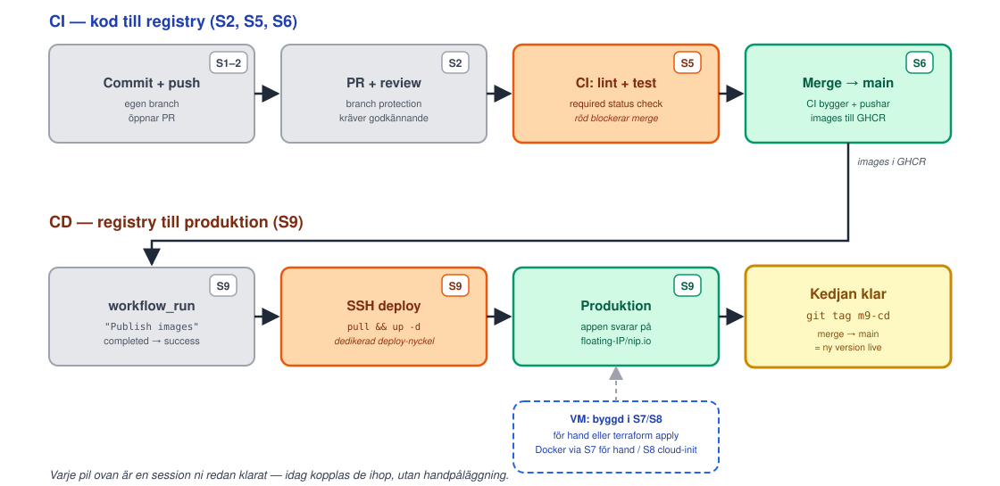

<!-- _class: lead -->
<!-- _footer: "" -->
<!-- _paginate: false -->

# CD — hela kedjan

## Session 9 · SSH-deploy, secrets-hygien, M9 — grundprojektet klart

Mjukvaruutvecklingsprocessen — DevOps
Arcada · 8.9–20.10.2026

---

## Läget: resultat från M8?

<style scoped>section { font-size: 27px; }</style>

- `fmt -check`/`validate` gröna; `apply` från noll → `Resources: 8 added`
- Appen svarar **utifrån** på floating-IP/nip.io-URL:en
- M7:s VM och floating IP rivna/släppta i Horizon (eller fanns aldrig)
- `terraform state list` visar alla åtta resursblock
- Rebuild-demot: **samma** `floating_ip` före och efter
- 6 skärmdumpar i `inlamning/m8-iac.md` på `main` via egen PR — taggen `m8-iac` pekar på `main`

**Fastnade du?** Ta det olöst hit. Labben kräver M6 klart (båda GHCR-paketen
**Public**) och **M8:s VM igång** — rev ni den: `terraform apply` igen i samma
codespace. Hoppade ni över M8 går M7-VM:en. Ingen VM alls? Steg 1, 2 och 7
går ändå — häng på ett par för resten, och kör M8 + M9 före S10.

---

## Löftet från förra torsdagen

> "**M9:** Actions deployar via SSH (`docker compose pull && up -d`),
> secrets-hygien. Ärlig diskussion om push-modellens svagheter → sår
> fröet till GitOps. **Grundprojektet klart.**"
> — Session 8, Nästa gång

Idag håller vi det löftet: samma två kommandon ni körde för hand i M7
och cloud-init körde åt er i M8 — nu körda av CI:n, vid varje merge
till `main`, utan att någon loggar in.

---

## Agenda idag

1. Läget efter M8
2. **Föreläsning:** CI vs CD vs continuous deployment, environments, secrets-hygien, den riktiga `deploy.yml`, deploy-strategier, svagheterna i push-modellen
3. Paus
4. **Lab M9** — nycklar, secrets, deploy.yml, merge, se kedjan köra
5. Wrap-up: verifiera M9, **grundprojektet klart**, nästa gång

---

<!-- _class: lead -->

# Del 1: CI, CD, continuous deployment — tre olika saker

---

## Tre begrepp, en bokstavskombination

- **Continuous Integration (CI)** — det ni redan har (S5, M5): varje
  ändring testas automatiskt så fort den öppnas som PR. Handlar om att
  UPPTÄCKA problem tidigt, inte om att leverera något
- **Continuous Delivery (CD)** — koden är ALLTID i ett tillstånd som
  KAN släppas (testad på PR:en (M4–M5), byggd och paketerad — images i
  GHCR efter varje merge, kört sedan M1, workflown er egen sedan S6/M6),
  men själva utrullningen till produktion kan fortfarande kräva ett manuellt klick
- **Continuous Deployment (också "CD")** — samma bokstäver, men här
  sker utrullningen till produktion HELT AUTOMATISKT, utan att en
  människa klickar "deploy". **Det är det ni bygger idag.**

---

<!-- _class: lead -->

# Del 2: Miljöer (environments)

---

## Dev, staging, prod — och var ni faktiskt befinner er

- En **miljö (environment)** är en isolerad körning av appen: egen
  databas, egna secrets, egen URL — typiskt **dev** (utvecklarens egen
  dator/branch), **staging** (en produktionslik miljö för sista
  kontroll) och **prod** (det riktiga, det användarna ser)
- **Ärligt läge i den här kursen:** ni har EN miljö — cPouta-VM:en är
  "prod", punkt. Ingen staging, ingen separat dev-server. Det gör M9
  enklare att bygga men också RISKABLARE: en trasig merge till main
  syns direkt för alla som besöker floating-IP:n, det finns ingen
  mellanstation att fånga upp felet i
- Spår C (DevSecOps) lägger till en riktig andra miljö (dev + prod via
  Terraform, prod bakom ett godkännande-steg) — precis den lucka ni ser

---

<!-- _class: lead -->

# Del 3: Secrets-hygien för deploy-nycklar

---

## Varför INTE återanvända Terraforms admin-nyckel

- Terraform (M8) injicerar redan en SSH-nyckel i VM:en — den som styr
  `ssh_public_key_path`, kopplad till admin-användaren `ubuntu` med full `sudo`
- Dagens deploy-workflow får en **egen, dedikerad nyckel** i stället:
  ett nytt SSH-nyckelpar vars ENDA jobb är att logga in som en
  begränsad `deploy`-användare och köra `docker compose pull && up -d`
- Motivet: om deploy-nyckeln någonsin läcker (t.ex. i en loggrad, en
  felkonfigurerad Action) ska skadan vara begränsad till "kan
  omstarta containrarna" — inte "har full root på VM:en"

---

## Least-privilege deploy-användare — och en ärlig brasklapp

- Deploy-användaren (`deploy`) skapas manuellt på VM:en, medlem i
  `docker`-gruppen, INGEN `sudo`, INGET lösenord — bara den ena
  SSH-nyckeln i `authorized_keys`
- **Ärligt talat:** medlemskap i `docker`-gruppen är i praktiken
  ROOT-EKVIVALENT — den som kan prata med Docker-daemonen kan starta en
  container med t.ex. `-v /:/host` och därifrån göra vad den vill på värden
- "Least privilege" här begränsar alltså vad som KRÄVS för att nå den
  nivån (ingen sudo, inget lösenord, bara en enda smal SSH-nyckel) —
  INTE vad ett läckt nyckelinnehav faktiskt ger tillgång till

---

## Host key-verifiering: pinna, lita aldrig blint

- SSH varnar första gången ni ansluter till en okänd server ("are you
  sure you want to continue connecting?") — det är servern som bevisar
  VEM den är, inte bara att trafiken är krypterad
- I CI finns ingen människa som kan svara "yes" på den frågan.
  Lösningen är att **pinna** värdens host-nyckel i förväg: kör
  `ssh-keyscan -H <floating-ip>` EN gång, spara resultatet, skriv det
  till `known_hosts` innan `ssh` körs
- Sedan körs `ssh` med `StrictHostKeyChecking=yes` — kopplingen vägrar
  om host-nyckeln någonsin skulle skilja sig från den pinnade. **Aldrig**
  `StrictHostKeyChecking=no`: det stänger av server-autentiseringen
  helt och accepterar tyst VILKEN host som helst (man-in-the-middle-bart)

---

## Secrets vs Variables: vad som är hemligt och vad som inte är

| Namn | Typ | Innehåll |
|---|---|---|
| `DEPLOY_SSH_KEY` | **Secret** | Privat del av deploy-nyckelparet |
| `DEPLOY_USER` | Variable | Deploy-användarens namn (`deploy`) |
| `DEPLOY_HOST` | Variable | VM:ens floating IP — samma som ni skannade (inte nip.io) |
| `DEPLOY_KNOWN_HOSTS` | Variable | Output av `ssh-keyscan`, pinnat i förväg |

Bara den privata nyckeln är hemlig — host-nyckeln är OFFENTLIG
information (vem som helst kan `ssh-keyscan` er VM), den behöver bara
pinnas i förväg, inte gömmas.

---

<!-- _class: lead -->

# Del 4: Den riktiga workflowen — `deploy.yml`

---

## Triggern: `workflow_run`, inte `push`

```yaml
on:
  workflow_run:
    workflows: ["Publish images"]
    types: [completed]
    branches: [main]
```

**Varför inte `push: branches: [main]` direkt?** Det skulle köra
PARALLELLT med "Publish images" (M6) — samma push-händelse — och kunna
hinna SSH:a in och köra `pull` INNAN den nya imagen ens finns i GHCR.

---

## Gaten: bara vid faktisk framgång

```yaml
permissions:
  contents: read

jobs:
  deploy:
    if: ${{ github.event.workflow_run.conclusion == 'success' }}
```

`workflow_run` triggar ÄVEN när "Publish images" misslyckas — `if:`-villkoret
stoppar jobbet då. `permissions: contents: read` trimmar bort
default-tokenens skrivrättigheter — jobbet öppnar bara en utgående
SSH-anslutning och behöver inte ändra något i repot eller registryt.

---

## Secrets/vars via `env:`, inte inline i skriptet

```yaml
    env:
      DEPLOY_USER: ${{ vars.DEPLOY_USER }}
      DEPLOY_HOST: ${{ vars.DEPLOY_HOST }}
      DEPLOY_KNOWN_HOSTS: ${{ vars.DEPLOY_KNOWN_HOSTS }}
      DEPLOY_SSH_KEY: ${{ secrets.DEPLOY_SSH_KEY }}
    steps:
      - run: |
          mkdir -p ~/.ssh
          install -m 600 /dev/null ~/.ssh/deploy_key
          printf '%s\n' "$DEPLOY_SSH_KEY" > ~/.ssh/deploy_key
          printf '%s\n' "$DEPLOY_KNOWN_HOSTS" > ~/.ssh/known_hosts
```

---

## Själva deployen: två kommandon, alltid samma ordning

```yaml
      - run: |
          ssh -i ~/.ssh/deploy_key -o StrictHostKeyChecking=yes \
            "$DEPLOY_USER@$DEPLOY_HOST" \
            'docker compose -f /opt/app/docker-compose.yml pull && docker compose -f /opt/app/docker-compose.yml up -d'
```

`/opt/app/docker-compose.yml` skrev cloud-init på M8:s VM — samma fil
ni skrev för hand i M7 steg 9. `pull` hämtar de nya imagerna
**Publish images** just publicerade (anonymt — därför måste paketen
vara Public, M6), `up -d` startar om containrarna mot dem — bara om
`pull` lyckades (`&&`). Utan `sudo` — `deploy` är med i `docker`-gruppen.

---

<!-- _class: lead -->

# Del 5: Deploy-strategier — ärligt om vad ni bygger idag

---

## Idag: "stop-the-world" — och det är okej att veta det

- `docker compose up -d` STÄNGER AV de gamla containrarna innan de nya
  startar — appen svarar INTE under de sekunderna (ett kort avbrott —
  och eftersom de två containrarna byts en i taget kan till och med en
  kort stund av blandade versioner uppstå)
- Namn på mer sofistikerade strategier (begrepp idag, INTE något ni
  implementerar):
  - **Blue/green** — två kompletta miljöer, växla trafiken direkt
  - **Rolling** — byt ut instanser en i taget
  - **Canary** — släpp nya versionen till en liten andel trafik först
- Alla tre kräver FLERA instanser att växla mellan — er ensamma VM har
  bara en. En infrastrukturbegränsning, inte en workflow-begränsning

---

<!-- _class: lead -->

# M9: hela kedjan, kopplad

---

## Från commit till produktion



---

## Innan ni bygger det: svagheterna i push-modellen

<style scoped>section { font-size: 24px; }</style>

- **Push, inte pull** — CI:n har en nyckel in i produktionen och initierar ändringen själv. GitOps (spår B) vänder på det: en agent i miljön *drar* från Git, CI:n har inga inloggningsuppgifter till produktionen
- **Nyckeln är långlivad** — `DEPLOY_SSH_KEY` dör inte med jobbet som `GITHUB_TOKEN` gör. Läcker den har någon annan `docker` på er VM tills ni roterar
- **Snowflake-deploy** — `deploy`-användaren och `authorized_keys` sätts upp för hand (steg 3). Ingen kod återskapar dem: bygger Terraform om VM:en är de borta
- **Ingen rollback** — `pull && up -d` skriver över det som kördes. "Tillbaka till igår" finns inte inbyggt (jämför `kubectl rollout undo`, Git-historiken i GitOps)
- **Gaten är inte testerna** — kedjan kör aldrig pytest; bara rulesetet (M5) står mellan en otestad commit och VM:en. Och: en enda miljö, stop-the-world

Medvetet enkelt — och fullt tillräckligt för M9. Spår B svarar på de flesta punkterna i morgon.

---

<!-- _class: lead -->

# Lab: M9

## Deploy-nyckel · deploy-användare · secrets · merge → se kedjan köra

---

## M9 — dagens milstolpe

<style scoped>section { font-size: 24px; }</style>

**Mål:** en synlig ändring mergad till main syns på produktions-URL:en — utan handpåläggning på VM:en.

1. Steg 1: läs `deploy.yml` — `workflow_run`, `if:`, `permissions`, de fyra namnen
2. Steg 2–4: eget nyckelpar, `deploy`-användare på VM:en (`id deploy` 📸), manuellt SSH-test
3. Steg 5–6: `ssh-keyscan -H` på IP:n → `DEPLOY_*` i Secrets + Variables (båda flikarna 📸)
4. Steg 7–8: `actionlint`; PR med synlig ändring i `frontend/` → review → merge
5. Steg 9–10: **Publish images** → **Deploy to VM** gröna 📸, `curl` + nip.io i webbläsaren 📸
6. Steg 11: 4 skärmdumpar + `inlamning/m9-cd.md` via PR — kontrollera `main`, tagga då `m9-cd`

**Par:** ägaren steg 2, 4–6 + inlämnings-PR:en; Terraform-köraren 3; partnern 7–8. **Solo:** radkommentar.

---

## Grundprojektet klart

- **M1–M9 = grunden** (betygsrubriken från dag 1): den som hänger med i
  undervisningen har grunden klar EFTER IDAG — inte efter spårveckorna
- Ni har byggt, utan att skriva om det: versionshantering med
  branch-skydd (M2), containeriserad app (M3), automatisk testning
  (M4–M5), automatisk image-publicering (M6), en riktig molnmiljö (M7),
  den miljön som kod (M8), och nu en helt automatisk väg dit (M9)
- **Kvaliteten** på kedjan avgör poängen per milstolpe (0–9 p, upp till
  81 p för M1–M9) plus bonusen (+10 p för repo-hygien, commit-historik,
  PR-disciplin, fungerande kedja) — utan final task med live-demo är
  taket betyg 4; final task (spårval i morgon, live-demo i ert bokade
  pass 19–20.10) är det som tar er till betyg 5

---

## Wrap-up: är M9 klar?

<style scoped>section { font-size: 24px; }</style>

Kör checklistan tillsammans:

- [ ] `actionlint` grönt, noll findings; `id deploy` visar gruppen `docker`
- [ ] Deploy-nyckeln testad manuellt: `compose … ps` som `deploy`, utan `sudo`
- [ ] Secrets/vars satta: `DEPLOY_SSH_KEY`, `DEPLOY_USER`, `DEPLOY_HOST` (IP:n), `DEPLOY_KNOWN_HOSTS`
- [ ] Egen PR med synlig ändring mergad efter review, grön `Lint and test backend`
- [ ] **Publish images** → **Deploy to VM** gröna; ändringen syns på floating-IP/nip.io **utifrån**, `/api/health` svarar
- [ ] 4 skärmdumpar i `inlamning/m9-cd.md` på `main` via egen PR — **i par:** var sin PR
- [ ] Taggen `m9-cd` pekar på `main` efter sista mergen

Fastnade du? Ta det **olöst** till session 10 — M1–M9 (inkl. M4 om den saknas) bör vara klara då.

---

## Nästa gång

**Session 10 · fr 9.10 kl 13:00 — Spårval + kickoff**

Demo av alla tre spår — GitOps-demot svarar på svagheterna från i dag:
samma app, men produktionsändringar sker ENBART via en mergad PR mot
ett manifest-repo, ingen SSH-nyckel någonstans i CI:n.

**Ta med:** en `m9-cd`-taggad miljö — och svagheter-listan i minnet, ni
kommer känna igen punkt för punkt i demot.

